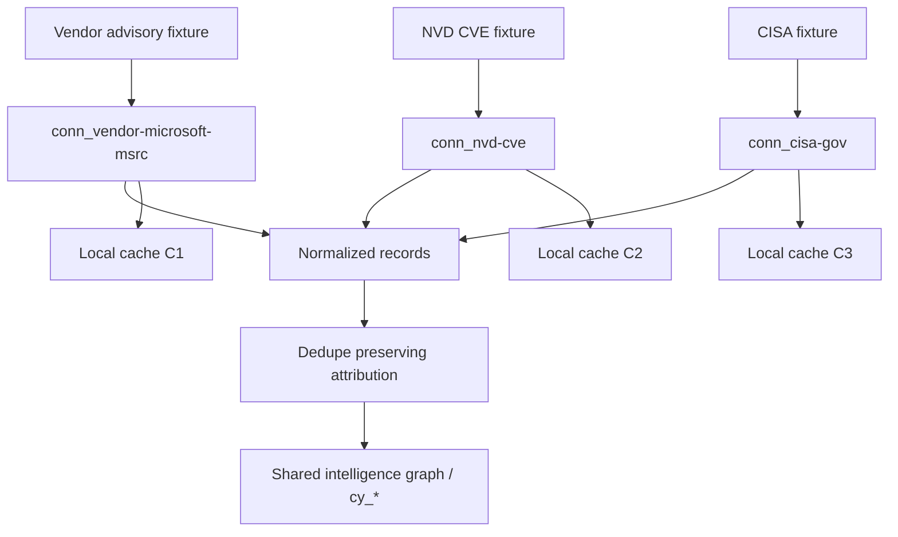

# Cyber Ingestion Architecture

**Status:** Architecture V0.1 + mock pipeline prototype  
**Package:** `design-system/signalterrain/intelligence/cyber/ingestion/`  
**Health UI (internal):** `apps/signalterrain/cyber/ingest-health.html`  
**Tagline:** Trustworthy ingestion — not maximum collection

---

## Mission

Transform many public information sources into SignalTerrain’s unified cyber intelligence model — defensively, educationally, and with full attribution.

This is **not** bulk harvesting. Connectors are independently replaceable, testable, trusted, cached, and documented. **No source knows about any other source.**

---

## Data flow

```
Public sources (future live / V0.1 mock fixtures)
        │
        ▼
┌───────────────────┐
│  Connector N      │  ← own fetch, own cache key, own normalizer
│  (isolated)       │
└─────────┬─────────┘
          │ normalized-record[]
          ▼
┌───────────────────┐
│  Ingest framework │  dedupe (keep provenance) · change detect · health
└─────────┬─────────┘
          │
          ├─► cy_* entities / UIO attach (Cyber Awareness + Intelligence Core)
          └─► local cache (per connector)
```



---

## Connector interface

Schema: `schema-connector-v0.1.json`  
Catalog: `connectors.json`

Each connector exposes:

| Field | Purpose |
|-------|---------|
| name / category / version | Identity |
| refreshInterval | Expected cadence |
| reliability | Trust hint (not severity) |
| lastSuccessfulUpdate / lastFailure | Health |
| supportedDataTypes | What it can emit |
| rateLimits | Designed limits for live mode |
| attribution | How to cite |
| honesty | neverFabricate / labelSamples / noExploitPayloads |
| normalizeContract | Raw → `normalized-record[]` |
| cachePolicy | TTL + offline usefulness |

Categories scaffolded in V0.1:

Security advisories · Vendor advisories · Vulnerability databases · Government advisories · Security news · Ransomware tracking · Patch bulletins · Threat intel blogs · Academic publications

---

## Runtime

| Module | Role |
|--------|------|
| `wds-signalterrain-cyber-ingest.js` | Normalize finalize, dedupe, change detect, cache, health, provenance Q&A |
| `wds-signalterrain-cyber-connectors.js` | Per-connector mock fetch + normalizers (isolated) |

---

## Relationship to prior work

| Prior | Role |
|-------|------|
| Intelligence Core `providers.json` | High-level provider contracts (`prov_*`) |
| Cyber Awareness `cy_*` | Durable/shared intelligence entities |
| Ingestion `conn_*` | Operational connectors producing normalized records |

Live feeds later map into the same normalized schema — no rewrite of the cyber graph.

---

## Related

- [CYBER-NORMALIZATION.md](CYBER-NORMALIZATION.md)  
- [CYBER-PROVENANCE.md](CYBER-PROVENANCE.md)  
- [CYBER-CACHE.md](CYBER-CACHE.md)  
- [CYBER-INTELLIGENCE-MODEL.md](CYBER-INTELLIGENCE-MODEL.md)  
- [SIGNALTERRAIN-INTELLIGENCE-CORE.md](SIGNALTERRAIN-INTELLIGENCE-CORE.md)
