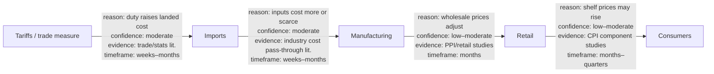
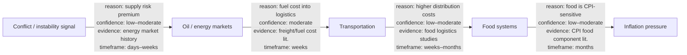

# Global Signals — Cascading Impact Explorer

**Status:** Design only — **not implemented**  
**Product:** Global Signals (Side Trails)  
**Primary question:** *Starting from one event, what downstream effects are plausible — and why?*  
**Related:** [SIGNALTERRAIN-RELATIONSHIP-MODEL.md](SIGNALTERRAIN-RELATIONSHIP-MODEL.md), [RELATIONSHIP-TYPES.md](RELATIONSHIP-TYPES.md), [articles/articles-architecture.md](articles/articles-architecture.md), [PRODUCT_STANDARDS.md](PRODUCT_STANDARDS.md)

---

## 1. Purpose

The **Cascading Impact Explorer** helps citizens and curious readers walk **downstream relationships** from a single public event or policy signal — trade measures, conflict reports, energy disruptions, weather extremes, infrastructure incidents, and similar — without turning the product into a news ticker or a conspiracy board.

It answers:

> Given this sourced starting event, which later domains *may* be affected, through what mechanism, with what confidence, over what timeframe, and with what evidence?

It does **not** answer:

> What will definitely happen next? Who should I fear? How do I exploit markets, people, or systems?

This document is a **design contract**. No interactive cascade runtime ships in this branch. Example chains below are **schematic educational illustrations**, not live forecasts and not claims about any particular day’s events.

---

## 2. Design principles

| Prefer | Refuse |
| --- | --- |
| Explicit reason on every edge | Silent arrows that look “proven” |
| Confidence labels on every edge | Implied certainty or “will cause” copy |
| Evidence (URL or citable public source) | Fabricated live events or invented citations |
| Expected timeframe bands | Fake precision clocks |
| Expand-on-demand branches | Dense auto-expanded doom graphs |
| Citizen impact literacy | Surveillance, targeting, or partisan theater |
| Calm intelligence chrome | Urgency hacks, siren colors, engagement farming |

**Never imply certainty.** Default language is *may*, *often*, *historically associated*, *estimated*. Strong causal wording requires strong evidence and still carries a confidence ceiling below “certain.”

---

## 3. Product fit

Global Signals helps people understand how geopolitics, trade, infrastructure, weather, conflict, energy, cyber events, and government policy can ripple through supply chains, industries, and daily life. Cascading Impact Explorer is the **relationship walk** surface for that mission — an intelligence literacy tool, not a news website.

| Adjacent surface | Relationship |
| --- | --- |
| Relationship Engine / typed edges ([SIGNALTERRAIN-RELATIONSHIP-MODEL.md](SIGNALTERRAIN-RELATIONSHIP-MODEL.md), [RELATIONSHIP-TYPES.md](RELATIONSHIP-TYPES.md)) | Cascade edges reuse the same honesty fields: type, label, confidence, sources/notes. Global Signals may extend type vocabulary for civic/economic cascades (`affects`, `depends_on`, `caused_by`, `observed_with`, `associated_with`) without inventing certainty. |
| Waypoint Articles ([articles/articles-architecture.md](articles/articles-architecture.md)) | Evidence cards may deep-link to curated outdoor/science/context reading when relevant; Articles never become full-article republication inside a cascade node. |
| SignalTerrain Intelligence Map / posture docs | Sibling Side Trails intelligence patterns (evidence-first, calm UI). Cascades are **economic / civic / systemic literacy**, not cyber attack maps. |

---

## 4. Core objects

### 4.1 Event (seed)

| Field | Design |
| --- | --- |
| `id` | Stable id (`gs_evt_*`) |
| `title` | Plain-language public event or policy name |
| `summary` | Short neutral description |
| `occurred` / `announced` | Time window as published (not invented) |
| `geography` | Coarse only (global · continental · regional · country-coarse) |
| `evidence` | ≥1 public source URL or official identifier |
| `confidence` | Of the *event’s existence/reporting*, separate from edge confidence |
| Honesty | No seed without evidence. Demo seeds labeled **SAMPLE / schematic**. |

### 4.2 Domain node

A domain is a literacy bucket along a cascade (e.g. Imports, Manufacturing, Retail, Consumers; Oil, Transportation, Food, Inflation). Domains are **not** people, households, or surveillance targets.

### 4.3 Cascade edge (connection) — required fields

Every connection **must** include all four:

| Field | Meaning | Honesty rule |
| --- | --- | --- |
| **reason** | Plain-language mechanism (“higher input costs may pass into shelf prices”) | No reason → no edge |
| **confidence** | `high` · `moderate` · `low` · `speculative` | UI must show the label; never hide behind color alone |
| **evidence** | Citations supporting the *relationship pattern* (studies, official stats, reputable reporting on the mechanism) | Mechanism evidence may be historical/general; must not fake a live citation for today’s event |
| **expected timeframe** | Band such as `days` · `weeks` · `months` · `quarters` · `years` · `uncertain` | Bands only — no false precision |

Optional: `relationshipType` (align with Relationship Engine), `notes` / caveats, `conflictsWith` (competing explanations).

### 4.4 Cascade branch

A branch is an ordered or tree-shaped path of edges from the seed. Users expand nodes to reveal children; the system may propose likely next domains but **must not** auto-claim outcomes.

---

## 5. Interaction model (documented only — not built)

Calm, progressive disclosure. One composition at a time.

### 5.1 Start

1. User opens an event dossier (from a Global Signals list, map, or search).  
2. Primary CTA: **Explore cascading impacts**.  
3. Shell paints immediately with the seed node + honesty banner (“Estimated pathways — not predictions”).

### 5.2 First hop

- Show **1–3** high-signal first-hop domains by default (not the full graph).  
- Each edge card shows reason, confidence chip, timeframe band, and evidence count/link.  
- Empty or sparse first hops stay empty — never invent filler branches.

### 5.3 Expand / collapse

- **Expand** (click / Enter on a domain): reveal proposed downstream children for that node only.  
- **Collapse**: hide children; keep focus on the parent.  
- **Depth limit (proposed):** soft stop at 4–5 hops with “further hops are increasingly speculative” copy.  
- **Branch switch:** selecting another sibling collapses the previous deep branch (one deep trail emphasis) unless the user pins a comparison (optional later).

### 5.4 Inspect an edge

Opening an edge opens a side panel / bottom sheet:

1. Reason (full text)  
2. Confidence + what would raise/lower it  
3. Evidence list (titles + publishers + links)  
4. Expected timeframe + caveats  
5. Alternate / conflicting pathways if present  

No hover-only provenance.

### 5.5 Filters (optional, quiet)

- Minimum confidence  
- Timeframe band  
- Domain tags (trade, energy, food, policy, …)  
- “Show speculative” off by default  

### 5.6 Motion & a11y (design intent)

- Restrained expand/collapse; respect `prefers-reduced-motion`.  
- Keyboard: Tab through nodes/edges; Enter expand/inspect; Escape close panel.  
- Accessible names include domain, confidence, and “estimated pathway.”  
- Do not rely on color alone for confidence.

### 5.7 Mobile

Vertical trail + bottom sheet for edge detail. Same required fields; no desktop-only evidence.

---

## 6. Example cascades (schematic — not live events)

These examples teach the product shape. They are **illustrative patterns**, not forecasts about named contemporary incidents. Visuals:  
`assets/images/global-signals/cascading-impact/`.

### 6.1 Trade measure → household prices

**Pattern:** Tariffs → Imports → Manufacturing → Retail → Consumers

| Edge | Reason (summary) | Confidence | Evidence (class) | Timeframe |
| --- | --- | --- | --- | --- |
| Tariffs → Imports | Duties and compliance can raise landed cost of covered goods | moderate | Official tariff schedules; trade statistics methodologies | weeks–months |
| Imports → Manufacturing | Costlier or delayed imported inputs can pressure production costs | moderate | Industry input-cost and inventory reporting (general) | weeks–months |
| Manufacturing → Retail | Producers/wholesalers may adjust prices downstream | low–moderate | Producer/wholesale price literature | months |
| Retail → Consumers | Retailers may pass through some costs to shelf prices | low–moderate | CPI/component and pass-through studies | months–quarters |

**Caveats:** Pass-through is incomplete and sector-specific; currency, inventories, competition, and exemptions can weaken or delay effects. Never present as “prices will rise X%.”

### 6.2 Conflict → inflation pressure

**Pattern:** Conflict → Oil → Transportation → Food → Inflation

| Edge | Reason (summary) | Confidence | Evidence (class) | Timeframe |
| --- | --- | --- | --- | --- |
| Conflict → Oil | Instability near production/transit can raise risk premia in energy markets | low–moderate | Historical energy-market responses to regional instability (general) | days–weeks |
| Oil → Transportation | Fuel is a major variable cost for freight and transit | moderate | Transport cost and fuel-share analyses | weeks |
| Transportation → Food | Distribution costs feed into food wholesale/retail | low–moderate | Food logistics and wholesale price literature | weeks–months |
| Food → Inflation | Food prices are a visible CPI component; moves can register as inflation pressure | low–moderate | CPI methodology and food-weight documentation | months |

**Caveats:** Many conflicts do not move oil; strategic reserves, demand destruction, and other commodities dominate. Inflation is multi-causal — a cascade edge is a literacy path, not a macro forecast.

### 6.3 Branching (interaction sketch)

From **Oil**, a user might expand alternate branches (e.g. Chemicals → Plastics → Consumer goods) each with their own reason/confidence/evidence/timeframe. Branches compete visually as **alternatives**, not as a single inevitable chain.

---

## 7. Visual documentation

| Asset | Path |
| --- | --- |
| Tariffs cascade (schematic) | [assets/images/global-signals/cascading-impact/tariffs-cascade.svg](../assets/images/global-signals/cascading-impact/tariffs-cascade.svg) |
| Conflict → oil cascade (schematic) | [assets/images/global-signals/cascading-impact/conflict-oil-cascade.svg](../assets/images/global-signals/cascading-impact/conflict-oil-cascade.svg) |
| Interaction model (expand branches) | [assets/images/global-signals/cascading-impact/interaction-model.svg](../assets/images/global-signals/cascading-impact/interaction-model.svg) |

All SVGs are labeled schematic / not live event graphs.

---

## 8. Evidence & uncertainty contract

1. **Seed events** require event-level evidence.  
2. **Edges** require mechanism-level evidence (may be general literature).  
3. UI distinguishes **event confidence** vs **edge confidence**.  
4. Missing any of reason / confidence / evidence / timeframe → edge cannot render.  
5. Speculative edges default hidden or visually demoted.  
6. Conflicting explanations surface via `conflicts_with` / alternate branches — do not pick a winner silently.  
7. No fabricated “breaking” nodes to fill the canvas.

---

## 9. Ethics & non-goals

**In scope:** citizen impact literacy; calm systemic understanding; cited public mechanisms.

**Out of scope forever for this explorer:**

- Surveillance of individuals or households  
- Targeting, profiling, or “who to watch” lists  
- Market-manipulation or trading advice presented as product guidance  
- Partisan campaign framing  
- Fabricated live cascades for engagement  
- Implying certainty about future prices, shortages, or political outcomes  

---

## 10. Relationship to Relationship Engine

Cascading Impact Explorer is a **product traversal UX** over typed, evidenced relationships. It should:

- Reuse confidence vocabulary (`high` · `moderate` · `low` · `speculative`)  
- Prefer precise types (`affects`, `depends_on`, `caused_by`, `observed_with`, `associated_with`) over vague `related_to` when possible  
- Keep sources on edges that claim causation or strong impact  
- Avoid guilt-by-association theater (same non-goals as [SIGNALTERRAIN-RELATIONSHIP-MODEL.md](SIGNALTERRAIN-RELATIONSHIP-MODEL.md))

A Global Signals–specific Relationship Engine design may extend schemas later; until then, SignalTerrain relationship docs are the honesty baseline.

---

## 11. Relationship to Articles

When an evidence item or domain context matches curated outdoor/science/policy literacy reading, the edge panel may offer a quiet “Related reading” link into [Waypoint Articles](articles/articles-architecture.md). Rules:

- Link out to publishers; do not republish full articles  
- Related reading is optional context, not proof of a cascade edge by itself  
- Articles relevance models stay separate from cascade confidence scoring  

---

## 12. Phased delivery (design roadmap only)

| Phase | Intent |
| --- | --- |
| A | This design + visuals + owner review (this branch) |
| B | Edge/node schemas aligned with Relationship Engine |
| C | Read-only cascade trail for 1–2 schematic SAMPLE seeds |
| D | Expand/collapse + edge inspector + confidence filters |
| E | Optional Articles-related reading join |

No ship dates implied.

---

## 13. Owner decisions needed

1. Soft depth limit of 4–5 hops with escalating speculative labeling?  
2. Speculative edges hidden by default?  
3. One deep branch at a time vs multi-branch pin/compare in v1?  
4. Reuse SignalTerrain confidence enums verbatim for Global Signals?  

---

## Related

- [docs/product/global-signals-cascading-impact-owner-review.md](product/global-signals-cascading-impact-owner-review.md)  
- [SIGNALTERRAIN-RELATIONSHIP-MODEL.md](SIGNALTERRAIN-RELATIONSHIP-MODEL.md)  
- [RELATIONSHIP-TYPES.md](RELATIONSHIP-TYPES.md)  
- [articles/articles-architecture.md](articles/articles-architecture.md)
