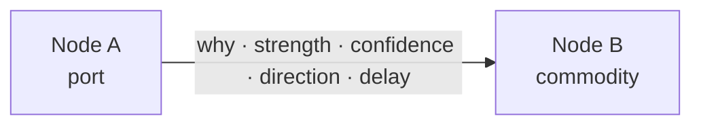
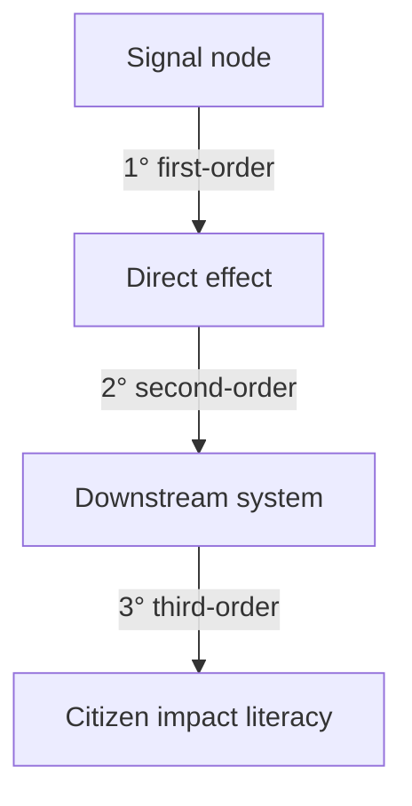

# Global Signals — Relationship Engine

**Status:** Design only — **not implemented**  
**Product:** Global Signals (Side Trails / SignalTerrain intelligence platform)  
**Branch intent:** Architecture and visual contracts for owner review  
**Related:** [SIGNALTERRAIN-RELATIONSHIP-MODEL.md](SIGNALTERRAIN-RELATIONSHIP-MODEL.md), [SIGNALTERRAIN-CORRELATION-ENGINE.md](SIGNALTERRAIN-CORRELATION-ENGINE.md), [SIGNALTERRAIN-INTELLIGENCE-MAP.md](SIGNALTERRAIN-INTELLIGENCE-MAP.md), [docs/side-trails/README.md](side-trails/README.md)

---

## 1. Purpose

The **Relationship Engine** is the core graph layer for Global Signals. Everything
the platform understands is a **node**. Everything that matters between nodes is a
**relationship** with explicit evidence-oriented metadata.

It answers:

> How do public signals connect — and what first-, second-, and third-order effects
> should a curious citizen or analyst understand, with honest confidence?

It does **not** answer:

> Who should we surveil? How do we attack? What fabricated “hot take” fills the map?

This document is a **design contract**. No graph runtime, ingest pipeline, or live
data product ships in this branch.

---

## 2. Design principles

| Prefer | Refuse |
| --- | --- |
| Connected nodes with typed edges | Isolated headline cards with no structure |
| Why / strength / confidence / direction / delay on every edge | Bare “related to” without rationale |
| Evidence-oriented confidence labels | Fake certainty or invented live events |
| Cascading impact literacy (1° → 2° → 3°) | Conspiracy-board density for spectacle |
| Citizens as **impact literacy** nodes | Citizens as surveillance or profiling targets |
| Calm, trustworthy intelligence tone | Urgency hacks, scarcity, engagement farming |
| Schematic cascade illustrations | Implying live telemetry from demo art |
| Honest empty / sparse graphs | Fabricating edges to look “smart” |

**Trust rule:** facts, estimates, and placeholders must stay visually and verbally
distinct. No fabricated live data. No offensive cyber guidance.

---

## 3. Node model

Every entity in Global Signals is a **node**. Nodes share a stable identity,
display label, type, optional geography coarseness, and provenance hooks.

### 3.1 Core node types (v0 catalog)

| Type | Role in the platform |
| --- | --- |
| `country` | Sovereign / territory abstraction (coarse) |
| `port` | Maritime / logistics choke or hub |
| `canal` | Constrained waterway (e.g. schematic canal corridor) |
| `shipping_lane` | Trade corridor abstraction |
| `company` | Named organization when publicly relevant |
| `industry` | Sector / vertical (energy, shipping, chips, …) |
| `commodity` | Traded good or input (oil, grain, semiconductors, …) |
| `energy` | Energy system node (grid region, fuel class, producer class) |
| `policy` | Public policy / regulation / guidance instrument |
| `tariff` | Trade measure with published scope |
| `war` | Armed conflict as publicly reported (coarse) |
| `sanction` | Formal restriction regimes (cited) |
| `weather` | Climate / weather system affecting logistics or demand |
| `cyber_attack` | Publicly reported cyber incident class (defensive literacy only) |
| `currency` | FX / monetary instrument affecting trade cost |
| `infrastructure` | Critical physical or digital infrastructure class |
| `citizen` | **Impact literacy** — how households/communities may feel effects; never surveillance |

Additional types may appear later (`region`, `alliance`, `standard`, `advisory`)
without changing the edge contract.

### 3.2 Node fields (design shape)

| Field | Meaning |
| --- | --- |
| `id` | Stable id (`gsn_*`) |
| `type` | One of the catalog types above |
| `label` | Human-readable name |
| `summary` | Short, calm description |
| `geoCoarse` | Optional: `global` · `continental` · `regional` · `country-coarse` |
| `sources` | Optional citations for the node’s existence/claim |
| `confidence` | Confidence in the *node claim* (separate from edge confidence) |
| `asOf` | Optional validity window start |
| `until` | Optional validity window end |

**Citizen nodes** describe *kinds of impact people may experience* (prices, delays,
service disruptions, civic information needs). They must never encode individuals,
households, biometrics, location tracks, or targeting lists.

---

## 4. Relationship model

A relationship is a directed (or explicitly bidirectional) edge between two nodes.
**Every relationship must contain** the five required facets below.

### 4.1 Required relationship facets

| Facet | Field | Meaning |
| --- | --- | --- |
| Why connected | `why` | Plain-language rationale for the link |
| Strength | `strength` | How strongly the connection matters (`weak` · `moderate` · `strong` · `critical`) |
| Confidence | `confidence` | Evidence quality (`high` · `moderate` · `low` · `speculative`) |
| Direction | `direction` | `a_to_b` · `b_to_a` · `bidirectional` (or `from`/`to` + `bidirectional` flag) |
| Time delay | `timeDelay` | Typical lag before effect shows (`immediate` · `hours` · `days` · `weeks` · `months` · `uncertain`) |

### 4.2 Full edge shape (design)

| Field | Required | Meaning |
| --- | --- | --- |
| `id` | yes | Stable id (`gsr_*`) |
| `from` | yes | Node id |
| `to` | yes | Node id |
| `why` | yes | Why these nodes are connected |
| `strength` | yes | Connection strength |
| `confidence` | yes | Evidence confidence |
| `direction` | yes | Causal / influence direction |
| `timeDelay` | yes | Expected lag class |
| `type` | recommended | Typed verb (`affects`, `constrains`, `depends_on`, `prices_through`, …) |
| `orderHint` | optional | Suggested cascade order (`1` · `2` · `3`) for narration |
| `sources` | strongly preferred | Citations; required before UI presents as non-speculative |
| `notes` | optional | Limits, caveats, counter-arguments |
| `observedAt` | optional | When the relationship was last evidenced |

Weak or speculative links stay labeled — or are omitted from default views.

### 4.3 Direction and delay semantics

- **Direction** is about influence or dependency, not map drawing. Bidirectional
  edges are allowed when both nodes mutually constrain each other (e.g. currency ↔
  commodity price feedback), and must say so in `why`.
- **Time delay** is a **class**, not a fake precise forecast. Use `uncertain` when
  sources disagree or lag is unknown. Never invent hour-level precision.

### 4.4 Confidence vs strength

| | Strength | Confidence |
| --- | --- | --- |
| Asks | How large is the effect if the link is real? | How well supported is the link? |
| Example | Canal closure → shipping delay can be **critical** | Claim may still be **moderate** confidence until official notices cite scope |

UI must show both. A critical-but-speculative edge must never look “certain.”

---

## 5. Cascade orders (first-, second-, third-order effects)

Cascades are **narrated chains of relationships**, not magic inference. Each hop
is an edge with the five required facets. Order is pedagogical:

| Order | Meaning | Example (schematic, not live data) |
| --- | --- | --- |
| **First-order** | Direct, near-term effect of a signal on a connected node | Conflict near a canal → canal constraint / shipping disruption |
| **Second-order** | Effect that follows because the first-order node changes | Shipping disruption → commodity delivery delay / freight cost pressure |
| **Third-order** | Downstream effects on industries, policy responses, or citizen impact literacy | Freight cost pressure → industry margin stress → household price / availability literacy |

### 5.1 Worked cascade A — maritime chokepoint (schematic)

```text
[War / regional conflict]  --1°-->  [Canal / shipping lane]
        why: conflict raises transit risk near corridor
        strength: strong · confidence: moderate · delay: hours–days

[Canal / shipping lane]  --2°-->  [Commodity / energy]
        why: delayed or rerouted cargo tightens near-term supply
        strength: moderate–strong · confidence: moderate · delay: days–weeks

[Commodity / energy]  --3°-->  [Industry] --3°--> [Citizen impact literacy]
        why: input costs and availability affect firms and household prices/services
        strength: moderate · confidence: low–moderate · delay: weeks–months / uncertain
```

Visual: [`assets/images/global-signals/relationship-engine/cascade-maritime.svg`](../assets/images/global-signals/relationship-engine/cascade-maritime.svg)

### 5.2 Worked cascade B — policy and tariffs (schematic)

```text
[Policy / tariff]  --1°-->  [Company / industry import path]
[Industry]  --2°-->  [Commodity substitution / currency pressure]
[Currency / commodity]  --3°-->  [Citizen cost-of-living literacy]
```

Visual: [`assets/images/global-signals/relationship-engine/cascade-policy.svg`](../assets/images/global-signals/relationship-engine/cascade-policy.svg)

### 5.3 Worked cascade C — weather → infrastructure → citizens (schematic)

```text
[Weather]  --1°-->  [Port / infrastructure]
[Infrastructure]  --2°-->  [Shipping lane / industry logistics]
[Industry logistics]  --3°-->  [Citizen service & supply literacy]
```

Visual: [`assets/images/global-signals/relationship-engine/cascade-weather.svg`](../assets/images/global-signals/relationship-engine/cascade-weather.svg)

### 5.4 Cascade engine rules (design)

1. **No hop without an edge** — UI must not invent 2°/3° steps without stored relationships (or an explicitly labeled hypothesis mode).
2. **Confidence degrades by default** along a chain unless each hop is independently evidenced at equal or higher confidence.
3. **Order is a view** — the same edge can appear in multiple cascades; orderHint is narrative, not physics.
4. **Citizen hops are literacy, not dossiers** — third-order citizen nodes explain *kinds of impact*, never identify people.
5. **Cyber hops are defensive** — `cyber_attack` nodes summarize public reporting and defensive implications only; no exploit content.

---

## 6. Graph layers and queries (design)

| Layer | Contains | Notes |
| --- | --- | --- |
| Nodes | All typed entities | Sparse honesty preferred |
| Relationships | Faceted edges | Five required facets always |
| Cascades | Ordered paths for explanation | Derived views over edges |
| Evidence | Citations attached to nodes/edges | Required for non-speculative display |

### 6.1 Intended query surface (future runtime)

- `getNode(id)`
- `neighbors(id, { minConfidence, maxDelay })`
- `cascade(fromId, { maxOrder: 3 })`
- `listByType(type)`
- `explainEdge(id)` → why, strength, confidence, direction, delay, sources

Apps should query the graph rather than hard-coding impact chains in UI copy.

---

## 7. Relationship to SignalTerrain graphs

Global Signals **generalizes** the Side Trails intelligence idea beyond cyber-only
topics:

| Existing | Global Signals Relationship Engine |
| --- | --- |
| SignalTerrain topic edges (`str_*`) | Broader node catalog + mandatory delay/strength |
| Correlation patterns (event sequences) | Cascade orders 1°/2°/3° as first-class narration |
| Intelligence Map geography | Optional `geoCoarse` on nodes; cascades remain primary literacy tool |

Do **not** silently merge id spaces. Future bridges may link `gsn_*` ↔ `st_*` /
`uio_*` with typed cross-store edges after owner approval.

---

## 8. Non-goals

- Live fabricated event feeds or “demo drama” edges  
- Offensive cyber, exploit packaging, or attack playbooks  
- Citizen surveillance, profiling, or precise individual targeting  
- Guilt-by-association theater or forced dense graphs  
- Precise victim coordinates or street-level harm maps  
- Automatic trading / investment advice presented as fact  
- Merging this design into production without a separate implementation branch  

---

## 9. Visual documentation

Schematic illustrations (not live data):

| Asset | Shows |
| --- | --- |
| [`cascade-overview.svg`](../assets/images/global-signals/relationship-engine/cascade-overview.svg) | Platform as connected nodes + 1°/2°/3° legend |
| [`cascade-maritime.svg`](../assets/images/global-signals/relationship-engine/cascade-maritime.svg) | Conflict → canal/lane → commodity → citizen literacy |
| [`cascade-policy.svg`](../assets/images/global-signals/relationship-engine/cascade-policy.svg) | Tariff/policy → industry → currency/commodity → citizens |
| [`cascade-weather.svg`](../assets/images/global-signals/relationship-engine/cascade-weather.svg) | Weather → port/infra → logistics → citizen impact |
| [`edge-anatomy.svg`](../assets/images/global-signals/relationship-engine/edge-anatomy.svg) | Required facets on a single relationship |

### Mermaid — edge anatomy



### Mermaid — three-order cascade



---

## 10. Accessibility and UX notes (design)

- Cascades read as **one composition per explanation**, not a dashboard of widgets.
- Edge facets must be available in text (not color-only).
- Speculative edges use explicit labels; never rely on opacity alone.
- Empty neighbor lists stay honest: “No evidenced connections yet.”
- Motion (when implemented) should clarify hop order, not pulse urgency.

---

## 11. Implementation status

**Not implemented.** This branch delivers documentation, schematic SVG assets, an
owner review, a docs presence smoke test, and playbook lessons only.

---

## 12. Related

- Owner review: [docs/product/global-signals-relationship-engine-owner-review.md](product/global-signals-relationship-engine-owner-review.md)  
- Side Trails: [docs/side-trails/README.md](side-trails/README.md)  
- SignalTerrain relationship foundation: [SIGNALTERRAIN-RELATIONSHIP-MODEL.md](SIGNALTERRAIN-RELATIONSHIP-MODEL.md)  
- Correlation patterns: [SIGNALTERRAIN-CORRELATION-ENGINE.md](SIGNALTERRAIN-CORRELATION-ENGINE.md)  
- Product standards: [PRODUCT_STANDARDS.md](PRODUCT_STANDARDS.md)  
