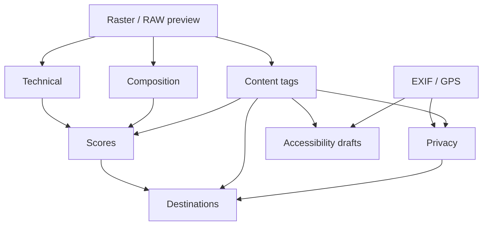

# Image Classification & Analysis

Local-first heuristics (Pillow + EXIF). **No cloud AI required.** Scores always include explanations.

## Analysis engine

`photo_pipeline.analyze` — `waypoint-local-heuristics-v1`

### Technical

| Estimate | Method (summary) |
|----------|------------------|
| Sharpness / blur | Edge-filter energy on downsampled RGB |
| Noise | Residual vs mild Gaussian blur |
| Exposure | Mean luminance + clip fractions |
| Contrast | Luminance standard deviation |

### Composition

| Estimate | Method |
|----------|--------|
| Composition | Interest near rule-of-thirds points |
| Leading lines | Edge energy proxy |
| Subject isolation | Sharpness + thirds + low noise blend |

### Content tags (confidence scored)

sky, water, flowers, mushrooms, trees, birds, mammals, macro, landscape, night, weather, trail, river, lake, mountain, people, vehicles, buildings, dogs, screenshots, documents

Birds/mammals/dogs/people default low — V1 has **no** neural detectors. Treat as review prompts.

RAW (ARW): analysis uses embedded JPEG preview via exiftool when available. Video: skipped for still analysis.

## Privacy

`photo_pipeline.privacy` — verdicts: **Safe** | **Needs review** | **Do not publish**

Flags GPS, screenshot/document-like frames, possible vehicles (plates), buildings, elevated people heuristic. Suggestions: Strip GPS, Needs review, Do not publish, Safe. **`auto_publish` is always false.**

## Destinations

Multi-label suggestions in `photo_pipeline.classify`:

Waypoint Studio, Scenes, Fieldry, Sheds, ForageCast, SignalTerrain, Steepleaf, LeafTurn, Hidden Landscapes, Photography Gallery, Dashboard backgrounds, Homepage hero, Article illustration

## Quality scores

`photo_pipeline.scores` — each 0–1 with explanation:

- Technical, Artistic, Educational  
- Website / Background / Hero / Article suitability  

No single opaque “AI quality” number.

## Accessibility drafts

`photo_pipeline.accessibility` — alt, caption, keywords, description, article topics, species guesses (tag-level), weather, season, time of day. Marked `editable: true`.

## Future modes (hooks only)

Infrared · UV · full spectrum · animal vision · phenology · time-lapse · Hidden Landscapes spectral — see `photo_pipeline.hooks`.

