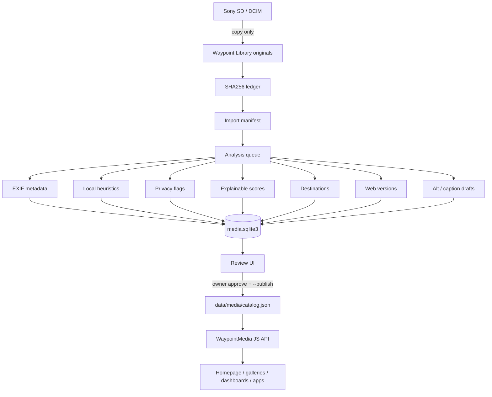

# Automated Photo Pipeline

**Waypoint Studio official photography pipeline** — not a stock manager, not a client DAM.

```
SD Card → Detect → Hash → Import new only → Manifest
       → Metadata → Thumbnails/versions → Local analysis
       → Privacy · Scores · Classification · Accessibility
       → Local Review UI → Owner Approve → Shared Media Catalog → Apps
```

## Design principles

| Rule | Enforcement |
|------|-------------|
| Originals sacred | Copy-only import; derivatives under `.waypoint-pipeline/` |
| Never modify originals | No exiftool `-overwrite_original` |
| Never delete automatically | No delete APIs in pipeline |
| Reproducible | SHA256 + manifests + SQLite |
| Local-first | Pillow heuristics; no cloud AI required |
| Owner approval before publish | `decide … --publish` is explicit |

## Components

| Piece | Location |
|-------|----------|
| Importer (GUI) | `waypoint-importer/` |
| Pipeline package | `photo_pipeline/` |
| Review UI | `apps/photo-pipeline/` |
| Website catalog | `data/media/catalog.json` |
| JS API | `design-system/js/media/waypoint-media-api.js` |

## Everyday workflow

```bash
# After SD import (auto-enqueued by importer) — or manually:
python -m photo_pipeline process --limit 50
python -m photo_pipeline export-review

# Review in browser (from repo root):
python -m http.server 8765
# open http://localhost:8765/apps/photo-pipeline/

# Apply a decision + publish derivatives into data/media:
python -m photo_pipeline decide wpmedia_… approve --publish \
  --dest "Photography Gallery" --dest "Scenes"
```

Scan existing library (idempotent by hash):

```bash
python -m photo_pipeline scan-library --limit 100
```

## Architecture



## Safety

- Importer never writes the SD card.
- Pipeline never overwrites library originals.
- Reject / hide leave files on disk for re-review.
- Website updates only via explicit `--publish`.

## Future hooks

See `python -m photo_pipeline hooks` — infrared, UV, full spectrum, animal vision, phenology, time-lapse, Hidden Landscapes spectral modes (architecture only in V1).

## Related docs

- [IMPORTER-AUDIT.md](./IMPORTER-AUDIT.md)
- [MEDIA-LIBRARY.md](./MEDIA-LIBRARY.md)
- [IMAGE-CLASSIFICATION.md](./IMAGE-CLASSIFICATION.md)
