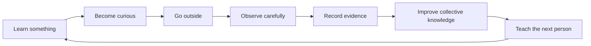

# Waypoint Studio — Theory of Change

How Waypoint Studio intends to improve outdoor learning and environmental understanding over time.

---

## The cycle

1. **A person learns something** — on the dashboard, in ForageCast, or through a field investigation.  
2. **They become curious** — a question replaces passive consumption.  
3. **They go outside** — the lesson demanded a walk, slope comparison, or phenology check.  
4. **They observe carefully** — separating sign from interpretation; ethics before action.  
5. **They record evidence** — in Fieldry (future WOS capture): date, place, habitat, weather, media, confidence.  
6. **The observation improves collective knowledge** — optional, informed, privacy-respecting contribution.  
7. **That knowledge teaches the next person** — regional intelligence, editorial briefs, phenology context.  
8. **The cycle repeats** — deeper each season.

---

## How each instrument serves the cycle

| Instrument | Primary cycle stages |
|------------|---------------------|
| **Dashboard** | Learn → curious → go outside |
| **ForageCast** | Learn → curious → observe (habitat & timing) |
| **Fieldry** | Observe → record → contribute |
| **Scenes** | Observe → reflect → share honest representation |

---

## What breaks the cycle

- Presenting predictions as guarantees  
- Gamifying finds, harvests, or miles  
- Social feeds instead of private ledgers  
- Precise public coordinates for sensitive species or harvest spots  
- National editorial bundles pretending to be local science  
- Shipping tools without lessons beside them  

---

## Success measures (qualitative)

- Visitors leave with a **question** and a **weekend investigation**  
- Observations (when capture exists) are **structured**, **uncertain where appropriate**, and **private by default**  
- Regional copy uses **tentative, field-teacher language**  
- Educators trust Pike County Preview as **honest scope**, not false scale  

---

## See also

- [STRATEGIC-DIRECTION.md](STRATEGIC-DIRECTION.md)  
- [WAYPOINT-METHOD.md](WAYPOINT-METHOD.md)  
- [WAYPOINT-OUTDOOR-ETHICS-STANDARD.md](WAYPOINT-OUTDOOR-ETHICS-STANDARD.md)
