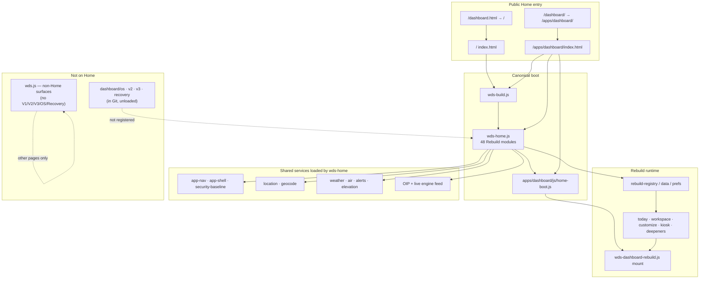

# Platform consolidation — owner review

**Date:** 2026-08-03  
**Branch:** `feature/platform-consolidation`  
**Base:** `origin/main` @ `59c09debbe8d9c7d36acf74607bd4ebfa55359fc`  
**Status:** Ready for owner review — **not** merged to main, **not** deployed.

---

## Purpose

Create one production-ready **Dashboard platform foundation** by reconciling
genuine improvements from turnaround sprints 02–04 onto `origin/main`, while
preserving Rebuild as the Home runtime and staying compatible with the 32-tile
catalog branch.

---

## Architecture

**Navigation:** Primary products remain Home · Scenes · Sheds · Articles · About.
Local Home features: Workspace · Customize (Kiosk is hash/mode, not a primary nav item).
Redirects: `dashboard.html` → `/`; `dashboard/index.html` → `/apps/dashboard/`.

---

## What was integrated

| Sprint | Meaningful commit(s) | Integrated |
| --- | --- | --- |
| **02** Public surface cleanup | `7f2681b` → cherry-picked as `b05eadf` | Yes |
| **03** Security hardening | `3901080` → `f920fa3` | Yes |
| **04** Canonical dashboard loader | `6db767a` → `2fe3ce5` | Yes |
| Automated publish commits | `Publish live engine artifacts…` | **Ignored** |

### Sprint 02 highlights
- Favicon.ico + public favicon links
- Stubbed public `status.html` / `debug.html`; operator dumps gated under `private/`
- Support “Coming later” promotion removed
- Pages workflow excludes internal docs/tooling from the artifact
- robots.txt + crawl/verify automation

### Sprint 03 highlights
- Honest meta CSP + referrer policy across public HTML
- External-link hardening via `wds-security-baseline.js`
- Privacy EXIF/location clarity
- Automated posture / secret-scan / CSP honesty checks

### Sprint 04 highlights
- New `design-system/js/wds-home.js` (48 modules) for Home
- `/` and `/apps/dashboard/` load `wds-home.js` instead of full `wds.js`
- Legacy eras documented in `LEGACY-NOT-LOADED.md` and guarded by
  `automation/test-canonical-dashboard-loader.mjs`
- `wds.js` stripped of Outdoor OS / V1–V3 / Recovery registrations

### Consolidation follow-ups (this branch tip)
- Asset validator skips non-Pages trees (`automation/`, `private/`, …)
- Loader header documents 32-tile catalog extension points
- Engineering playbook + this owner review

---

## Modules removed from live Home runtime

Unloaded on production Home (sources **retained** in Git unless noted):

| Area | Paths |
| --- | --- |
| Outdoor OS | `design-system/js/dashboard/os/*` |
| Dashboard V2 | `design-system/js/dashboard/v2/*` |
| Dashboard V3 | `design-system/js/dashboard/v3/*` |
| Recovery | `dashboard/wds-dashboard-recovery.js` |
| V1 dashboard | `wds-dashboard.js`, `dashboard/wds-dashboard-*.js` widgets/catalog/story |
| Legacy engines | `wds-dashboard-engine.js`, `wds-happening-now.js`, Home mount of `wds-content-engine.js` |
| OIE brief stack | `outdoor-intelligence/wds-oie-*.js` (Home uses OIP `get()`) |
| Non-Home packs | species/knowledge/education/gallery UI intel packs (still available via `wds.js` where needed) |

**Deletion policy:** Files were **not** deleted in this consolidation. Evidence of
“obsolete” here means **not registered by the live Home loader**. Physical deletion
remains owner-gated technical debt (era tests and history still reference them).

---

## Modules retained (canonical Home)

Loaded by `wds-home.js` (48):

- Core: `wds-core`, research integrity, provenance, outdoor ethics, icons
- Shell/nav: `wds-app-nav-config`, `wds-app-nav`, `wds-app-shell`, security baseline, resilience, platform UI, Take
- Location: US states, geocode, IP geolocation, national context, runtime migration, location context, platform guard, location
- Weather/OIP inputs: weather core/daylight/providers/service, NWS alerts, air quality, elevation, USGS water, trail conditions
- Regional + OIP: regional intelligence engine/core/sources, OIP model/location/sources/adapters/service, live engine feed
- Rebuild: reliability + `rebuild/{data,registry,prefs,today,workspace,customize,kiosk,deepeners,rebuild}.js`
- Boot: `apps/dashboard/js/home-boot.js`

`wds.js` retained for non-Home product pages (without legacy Dashboard eras).

---

## Performance changes

From Sprint 04 static measurement (see `docs/turnaround/2026-07-26-sprint-04/`):

| Metric | Before (`wds.js` on Home) | After (`wds-home.js`) | Delta |
| --- | --- | --- | --- |
| Modules | 165 | 48 | **−117** |
| JS bytes (sum) | ~1,837 KiB | ~502 KiB | **≈ −1.3 MiB** |
| Estimated JS requests | 166 | 49 | **−117** |

Startup reliability: Home still mounts Rebuild shell first via `home-boot.js`, with a
boot deadline + Retry path; OIP hydrate remains progressive after shell paint.

CI reliability: production asset validation no longer fails on local-only probes under
`automation/` (aligned with Pages exclusions).

---

## Compatibility with `feature/dashboard-functional-tile-catalog`

| Topic | Status |
| --- | --- |
| Rebuild module paths | Compatible — catalog extends the same `dashboard/rebuild/*` files |
| Home loader | **Conflict to resolve on catalog rebase:** catalog tip still loads full `wds.js` on Home; this branch requires `wds-home.js` |
| Cache-bust query | Catalog uses `dash-tile-catalog-1`; this branch uses `dash-canonical-1` — tests already accept both on consolidation |
| Tile count / registry | Catalog’s 32-tile registry is **not** merged here (by design). Rebase catalog onto this foundation, keep `wds-home.js` |
| Stashes / WIP | Untouched (`scenes`, `remember`, RC4 audit, etc.) |

**Recommended follow-up:** rebase or cherry-pick catalog Rebuild module diffs onto
`feature/platform-consolidation`, keep canonical loader, then re-run
`test-dashboard-functional-tile-catalog.mjs`.

---

## Test summary

Run from consolidation worktree (2026-08-03):

| Suite | Result |
| --- | --- |
| `automation/test-canonical-dashboard-loader.mjs` | PASS |
| `automation/test-dashboard-rebuild-phase1.mjs` | PASS (88) |
| `automation/test-dashboard-rebuild-phase2.mjs` | PASS (96) |
| `automation/test-dashboard-rebuild-phase3.mjs` | PASS (94) |
| `automation/test-dashboard-tile-layout-repair.mjs` | PASS |
| `automation/test-home-rc1.mjs` | PASS (56) |
| `automation/check-static-security-posture.mjs` | PASS |
| `automation/scan-public-secrets.mjs` | PASS (0 hits) |
| `automation/validate-production-assets.mjs` | PASS after SKIP_DIRS fix (previously failed on `automation/artifacts` probe) |
| `automation/smoke-sprint-03-security.mjs` | **Not run / blocked** — missing local `ws` dependency for browser CDP |

No merge to `main`. No deployment performed.

---

## Remaining technical debt

1. **Legacy source trees still in repo** — unload ≠ delete; owner decision needed for archival/removal.
2. **Catalog branch rebase** — must adopt `wds-home.js` when landing 32-tile work.
3. **Browser security smoke** — `smoke-sprint-03-security.mjs` needs documented install of Playwright/`ws` deps or CI image packing.
4. **Meta CSP limits** — honest GitHub Pages posture; no true `frame-ancestors` / HTTP security headers without an edge.
5. **Era-specific tests** (`test-dashboard-v2/v3/os-*`) still target unloaded code paths — keep or retire with legacy trees.
6. **Concurrent WIP** — scenes, remember, RC4, route inventory work remains on other branches/stashes; not integrated here.

---

## Owner decision checklist

- [ ] Approve consolidation tip for eventual main merge (separate change)
- [ ] Confirm legacy trees stay in Git for now
- [ ] Confirm catalog rebase plan (loader = `wds-home.js`)
- [ ] Decide whether to pack security browser smoke deps in CI
- [ ] Explicitly authorize deploy (not part of this branch)

