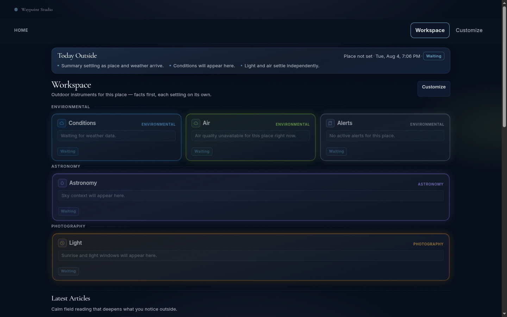
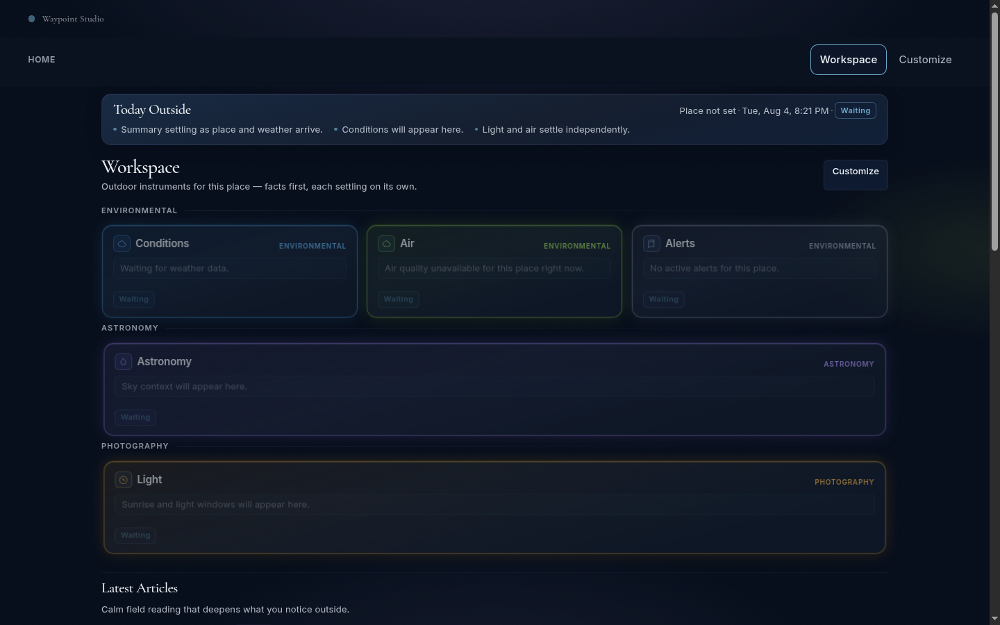
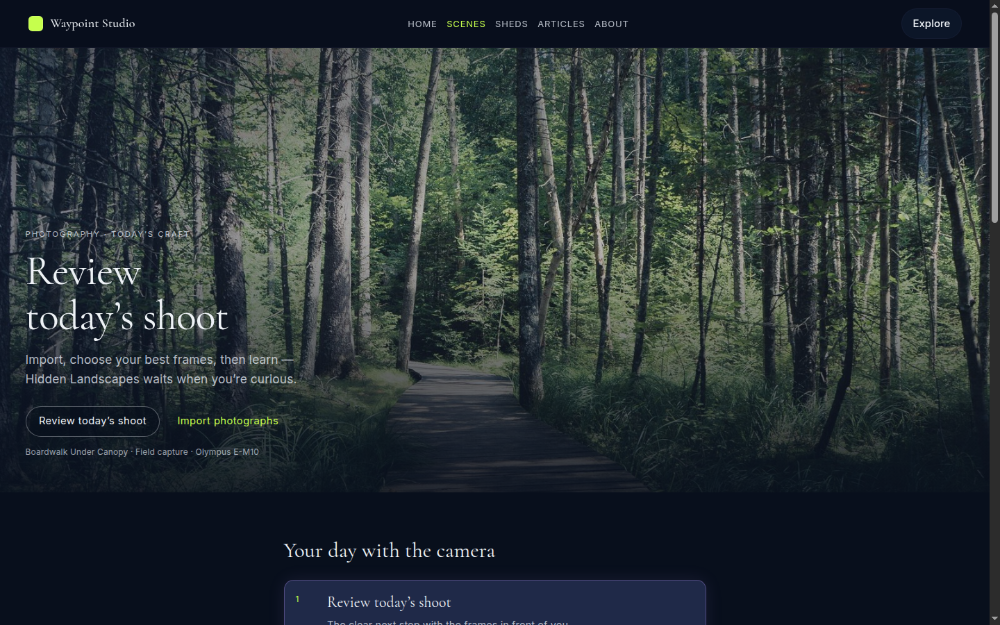
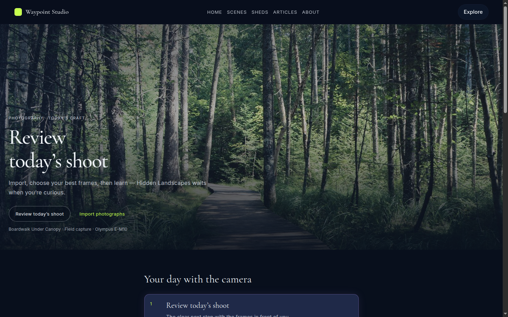
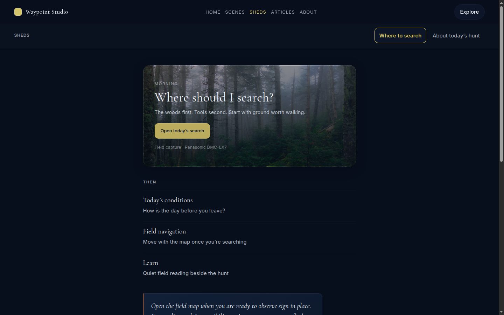
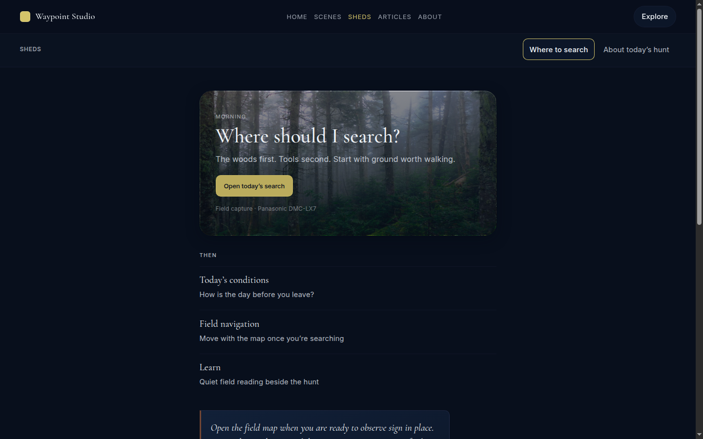
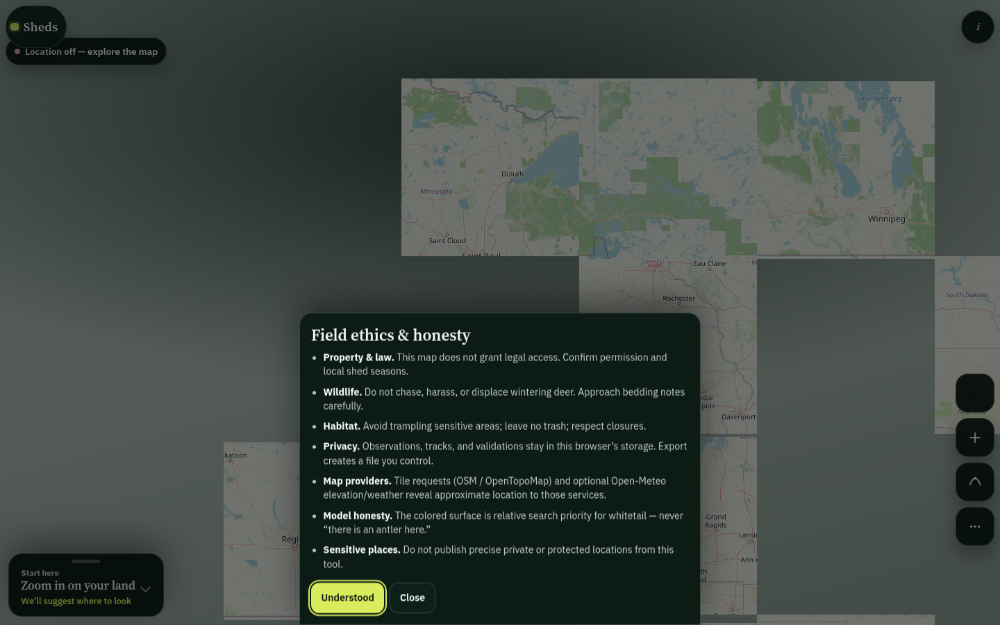
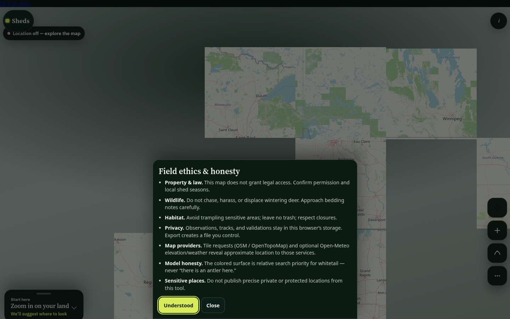

# Platform Polish — Owner Review

**Date:** 2026-08-04  
**Canonical path:** `docs/platform/platform-polish-owner-review.md`  
**Branch:** `feature/platform-polish` (from `origin/main`)  
**Scope:** Cross-product UI consistency for **Dashboard (Home)**, **Scenes**, and **Sheds** — safe repairs only  
**Status:** Documented + safe fixes landed on branch. **Not merged. Not deployed.**

---

## 1. Executive summary

Waypoint Studio already shares one app shell, but Dashboard / Scenes / Sheds still diverged in tokens, skip links, touch targets, fallback colors, typography micro-scale, and state class names. This pass audited those surfaces, recorded inconsistencies, and applied **token / shared-class / a11y** repairs only — no redesign, no new features, no IA changes.

**Recommendation:** Review screenshots + remaining work below; merge when owner is satisfied that visual delta stays within “one application” polish.

---

## 2. Branch and git hygiene

| Item | Value |
|------|--------|
| Base | `origin/main` |
| Branch | `feature/platform-polish` |
| Prior dirty tree | Stashed as `wip-before-platform-polish-20260804` (placeholders + route inventory) — **preserved, not dropped** |
| Parallel docs | Did **not** edit knowledge-engine / unified-metadata / image-processing docs or those worktrees |
| Merge / deploy | **None** |

Tip SHA is recorded at commit time in §11.

---

## 3. Surfaces reviewed

| Surface | Entry | Shell |
|---------|-------|-------|
| Dashboard / Home | `apps/dashboard/index.html` | Quiet WAS + Rebuild workspace |
| Scenes landing | `apps/scenes/index.html` | Full WAS, local nav hidden |
| Scenes studio (legacy) | `apps/waypoint-scenes/index.html` | WAS + builder bar |
| Sheds home | `apps/shed-hunting/index.html` | Full WAS + local nav |
| Sheds map | `apps/shed-hunting/map/index.html` | Immersive (no WAS) |

Shared foundations: `wds-app-shell.css`, `wds-aurora-bridge.css`, `wds-tokens.css`, `wds-base.css`, `wds-platform-ui.css`, `wds-experience-v2.css`, `wds-dashboard-rebuild.css`.

---

## 4. Inconsistency inventory (thorough)

### 4.1 Navigation

| ID | Finding | Class |
|----|---------|-------|
| N1 | Dashboard quiet chrome hides primary + Explore; Scenes/Sheds show full chrome | **DEFER** (intentional Home posture) |
| N2 | Scenes landing `data-hide-local="true"`; Sheds always shows local; modules also ship `scenes-module-nav` | **DEFER** (IA) — documented |
| N3 | Primary “Sheds” href → map, not product home | **DEFER** (start-here) |
| N4 | Primary nav styles live in aurora-bridge, not app-shell | **PARTIAL** — touch target fixed in place; full consolidation deferred |
| N5 | Primary nav `min-height: 2.5rem` (40px) vs 44px touch guidance | **FIXED** |
| N6 | Scenes/Sheds recolored current links instead of `--wds-accent` | **FIXED** |
| N7 | waypoint-scenes adds builder bar (third nav layer) | **DEFER** |
| N8 | Local current `font-weight: 550` (invalid) | **FIXED** → `500` |

### 4.2 Headers / typography

| ID | Finding | Class |
|----|---------|-------|
| H1 | Three hero systems (Rebuild instruments / full-bleed Scenes / inset Sheds stage) | **DEFER** (product identity) |
| H2 | Stage title scales & weights forked from `.wds-page-title` | **PARTIAL** — Sheds aligned to page-title clamp; Scenes keeps large stage scale, weight → 500 |
| H3 | Eyebrow letter-spacing/size forks | **FIXED** → `--wds-text-xs` + `--wds-tracking-wider` |
| H4 | Lead sizes ad hoc | **FIXED** → `--wds-text-md` / leading tokens |
| H5 | Reading width hardcoded `42rem` | **FIXED** → `--wds-max-reading` |
| T1 | Font weight sets differed (Inter 300 vs 400) | **FIXED** on Scenes/Sheds homes |

### 4.3 Cards / spacing / buttons

| ID | Finding | Class |
|----|---------|-------|
| C1 | Card primitives differ by product | **DEFER** shape; **FIXED** Scenes journey radius/duration tokens |
| S1–S2 | Gutter / reading width forks | **FIXED** clamp to shared gutter pattern |
| B1 | Multiple button systems (`.wds-btn`, `.wdb-r-btn`, pills, `.sheds-btn`) | **DEFER** unify shapes; landings already partly on `.wds-btn` |
| B2 | Scenes focus rings used violet; WDS focus is lime | **FIXED** → `--wds-focus` |

### 4.4 Empty / loading / errors

| ID | Finding | Class |
|----|---------|-------|
| E1 | Dashboard empty dashed panel only | **FIXED** — also `.wds-empty` / `.wds-state` |
| L1 | Boot used `.wdb-r-boot` only | **FIXED** — also `.wds-loading` |
| L2 | Map loader not aliased to platform map loading | **FIXED** — class alias + specificity guard |
| R1 | Boot error unmarked vs platform state | **FIXED** — `.wds-error` / `.wds-state` |
| R2 | Map offline unmarked | **FIXED** — `.wds-map-offline` / `.wds-offline-banner` classes |

### 4.5 Icons / motion / responsive

| ID | Finding | Class |
|----|---------|-------|
| I1 | Explore launcher letter tiles | **DEFER** |
| M2 | Journey transitions used raw `200ms` | **FIXED** → `--wds-duration-calm` |
| M3 | Conflicting `.sheds-skip` definitions | **FIXED** — map uses `.wds-skip`; experience-v2 + map CSS aligned |
| P3 | Map immersive `100dvh` | **DEFER** |

### 4.6 Skip links / a11y

| ID | Finding | Class |
|----|---------|-------|
| A1 | `.wds-skip` / `.skip-link` / `.sheds-skip` forks | **FIXED** on focus products + waypoint-scenes |
| A2 | Map skip target remains `#sheds-map` (correct landmark) | OK |
| A4 | Primary nav & shell controls → `--wds-touch-min` | **FIXED** |
| A6 | Focus color forks | **FIXED** on Scenes/Sheds list/CTA |

### 4.7 Shell fallbacks

| ID | Finding | Class |
|----|---------|-------|
| S4 | App-shell CSS fallbacks assumed light cream/white | **FIXED** — navy / off-white dark studio defaults |

---

## 5. Safe fixes applied (count: **24**)

1. Dark-aligned shell fallbacks (global, local, launcher, home cards, search).  
2. Invalid `font-weight: 550` → `500`.  
3. Primary nav min-height → `--wds-touch-min`.  
4. Shell control min-heights → `--wds-touch-min`.  
5. Scenes current-nav override removed (use `--wds-accent`).  
6. Sheds `--wds-accent: gold` + remove current-nav override.  
7. Scenes eyebrow / title weight / lead tokens.  
8. Scenes CTA focus → `--wds-focus`; radius/touch tokens.  
9. Scenes page reading width + gutter tokens.  
10. Scenes journey card radius / duration / focus tokens.  
11. Scenes primary kicker tokens.  
12. Scenes Inter weights aligned to Dashboard (400–600).  
13. Sheds stage eyebrow / title / lead / section tokens.  
14. Sheds page max-width + stage padding/radius tokens.  
15. Sheds secondary list focus + accent tokens.  
16. Sheds Inter weights aligned to Dashboard.  
17. Sheds map loads `wds-tokens.css`.  
18. Sheds map skip → `.wds-skip` only.  
19. Map loading/offline shared class aliases + loader specificity.  
20. `wds-experience-v2` `.sheds-skip` aligned to skip contract.  
21. waypoint-scenes skip → `.wds-skip` + CSS alias.  
22. Dashboard boot `.wds-loading`.  
23. Dashboard boot error `.wds-error` / `.wds-state`.  
24. Dashboard empty `.wds-empty` / `.wds-state` / `.wds-empty__title`.

Capture helper added: `automation/capture-platform-polish.mjs` (optional; screenshots below used Chrome headless `--screenshot`).

---

## 6. Screenshots (before / after)

Desktop 1440×900, local static server.

### Dashboard

| Before | After |
|--------|-------|
|  |  |

### Scenes

| Before | After |
|--------|-------|
|  |  |

### Sheds home

| Before | After |
|--------|-------|
|  |  |

### Sheds map

| Before | After |
|--------|-------|
|  |  |

**Visual note:** Safe fixes are mostly token/fallback/class alignment. Hero photography and product identity are unchanged by design. Sheds stage title scale moves slightly toward shared `.wds-page-title` clamp; Scenes full-bleed stage scale is intentionally preserved.

---

## 7. Accessibility review

| Check | Result |
|-------|--------|
| Skip link present on Dashboard / Scenes / Sheds home | Pass (`.wds-skip` → `#main`) |
| Skip link on Sheds map | Pass (`.wds-skip` → `#sheds-map`; map-specific reveal CSS retained) |
| waypoint-scenes skip | Pass (class standardized to `.wds-skip`) |
| Primary nav touch height | Pass (≥44px via `--wds-touch-min`) |
| Local nav / Explore / brand touch | Pass (tokenized) |
| Focus rings on Scenes CTA / journey | Pass (`--wds-focus`) |
| Boot / empty / error semantics | Improved (`role=status` / `role=alert` + shared state classes) |
| Reduced motion | Unchanged product blocks; duration tokens used where transitions were touched |
| Full WCAG audit | **Not claimed** — still remaining work |

Residual a11y gaps: launcher letter icons, Articles/About `aria-current`, touch-only lack of nav title hints, map dual font stack for immersive field UI.

---

## 8. Remaining work (deferred)

1. Decide whether Scenes landing should show shell local nav (N2).  
2. Unify primary “Sheds” start-here (map vs home) (N3).  
3. Move primary-nav rules from aurora-bridge into app-shell (N4).  
4. Converge button systems onto `.wds-btn` / map token aliases without reshaping immersive map chrome (B1).  
5. Adopt `WDS.platformUi` render helpers for async empty/error mounts.  
6. Shared font loading strategy (non-blocking) across all products; map IBM Plex decision.  
7. Quiet-chrome vs full Explore — confirm public Home policy (N1).  
8. Formal WCAG / Lighthouse pass.  
9. Retire duplicate `scenes-module-nav` once shell local covers module routes.  
10. Icon system for Explore launcher (I1).

---

## 9. Explicit non-goals (honored)

- No visual redesign of heroes, map HUD, or quiet Home.  
- No new features / widgets / workflows.  
- No merge to `main`, no production deploy.  
- No edits to parallel knowledge-engine / unified-metadata / image-processing documentation.

---

## 10. Files touched

| Path | Purpose |
|------|---------|
| `design-system/css/wds-app-shell.css` | Dark fallbacks, touch tokens, font-weight |
| `design-system/css/wds-aurora-bridge.css` | Primary nav 44px |
| `design-system/css/wds-experience-v2.css` | Skip contract alignment |
| `design-system/css/wds-dashboard-rebuild.css` | Empty title alias |
| `design-system/js/dashboard/rebuild/wds-dashboard-rebuild-workspace.js` | Empty shared classes |
| `apps/dashboard/index.html` | Boot `.wds-loading` |
| `apps/dashboard/js/home-boot.js` | Error shared classes |
| `apps/scenes/index.html` | Font weights |
| `apps/scenes/css/scenes-home.css` | Tokens, focus, nav accent |
| `apps/shed-hunting/index.html` | Font weights |
| `apps/shed-hunting/css/sheds-home.css` | Tokens, accent, focus |
| `apps/shed-hunting/map/index.html` | Tokens stylesheet, skip, state classes |
| `apps/shed-hunting/css/sheds-map.css` | Skip + loading alias |
| `apps/waypoint-scenes/index.html` | Skip class |
| `apps/waypoint-scenes/css/studio-shell.css` | Skip alias |
| `automation/capture-platform-polish.mjs` | Screenshot helper |
| `docs/platform/platform-polish-owner-review.md` | This review |
| `docs/platform/screenshots/{before,after}/*` | Evidence |

---

## 11. Delivery checklist

- [x] Review Dashboard / Scenes / Sheds inconsistencies  
- [x] Document thoroughly  
- [x] Safe WDS-aligned repairs only  
- [x] Before/after screenshots  
- [x] Owner review at `docs/platform/platform-polish-owner-review.md`  
- [ ] Owner merge decision  
- [ ] Deploy (out of scope)

**Tip SHA:** `448319105c975a7511fe125537cf496b2973fb67`  
**Push:** confirmed to `origin/feature/platform-polish`
