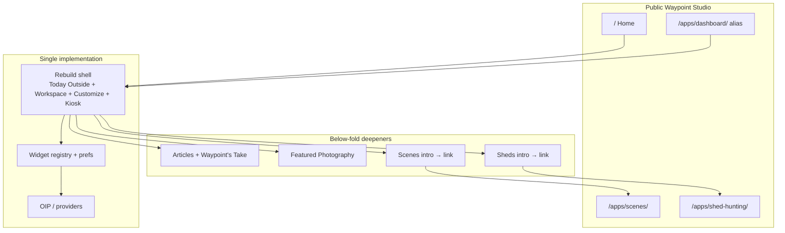

# Waypoint Studio 2026 Rebuild — Home Vision Lock

**Status:** OWNER VISION LOCK — documentation only
**Date:** 2026-07-22
**Authority:** Owner permanent product decision (this document)
**Supersedes (for public product identity):** Historical studio homepage marketing IA; competing “Dashboard vs Home” dual primary experiences; Outdoor OS / Recovery as public faces

### Confirmation

**NO CODE WAS MODIFIED** in producing this review.
**NO mockups, commits, pushes, merges, or deployments** were performed.

---

## 1. Product philosophy

### Owner decision (locked)

Waypoint Studio is **no longer** a marketing website with separate applications bolted on.

**Waypoint Studio IS the application.**

The previous homepage is **retired** as a product concept.

The **current Dashboard Rebuild (Phase 2 visual language)** becomes the new **public-facing Home** experience.

This decision is **locked** unless the owner explicitly changes it.

### Mission alignment

Mission remains:

**Observe. Discover. Understand.**
Tagline: *Capture what you find. Learn why it matters.*

Home answers first:

**“What's happening outside today?”**

Everything else — articles, Scenes, Sheds, Waypoint's Take — **deepens** that experience. It does not replace it.

### What Home is / is not

| Home is | Home is not |
|---------|-------------|
| Where users begin every day | Marketing |
| Customizable outdoor workspace | Landing / sales page |
| Information-first instruments | Outdoor OS briefing |
| Observational | Coaching / homework / AI recommendation theater |
| One canonical experience | Two competing primaries (old home + Dashboard) |

### Anti-regression (locked)

Do **not** restore as product authority:

- Outdoor OS
- Recovery Dashboard
- Historical homepage
- Old multi-product Explore navigation as the primary face
- Volunteer, SignalTerrain, Steepleaf, Savant Sommelier, Fieldry as peers of Home

Historical docs and code remain **references only**.

---

## 2. Navigation philosophy

### One public entry

| Role | URL | User-facing name |
|------|-----|------------------|
| **Canonical entry** | `https://waypointstudio.org/` | **Home** |

There must **never** be two competing primary experiences.

Do **not** maintain:

```
Old Homepage  +  Dashboard
```

There is only:

```
Home
```

### Internal vs user language

| Layer | Name |
|-------|------|
| User | **Home** |
| Internal architecture (allowed) | Dashboard / `apps/dashboard/` / engine / widgets / tests / CSS / JS |

**Do not** perform a repository-wide rename of `dashboard` → `home`.
Users experience **Home**; engineers may keep **Dashboard** as the module name.

### Global navigation (after Home lock)

Above-the-fold primary chrome stays the Rebuild shell:

- Brand: Waypoint Studio (lands on Home)
- Local: **Workspace · Customize · Kiosk** (as today)
- Product depth links (Scenes, Sheds) appear in **scroll sections** and footer-adjacent discovery — not as a second primary shell competing with Workspace

Scenes and Sheds remain **dedicated apps**. Home **introduces and links**; Home does **not** embed them.

---

## 3. Page hierarchy

### Above the fold (locked structure)

1. **Waypoint Studio** (quiet brand / shell)
2. **Today Outside** (compact observational summary, ≤8 bullets)
3. **Workspace** (customizable widgets — defining feature)

This is the permanent primary experience. Phase 2 visual design is the identity.

### Below the fold (supporting — does not replace Workspace)

In scroll order:

4. **Latest Articles**
5. **Waypoint's Take** (editorial — not an AI summary system)
6. **Featured Photography**
7. **Scenes** (intro + link into Scenes app)
8. **Sheds** (intro + link into Sheds app)
9. **Footer** (Contact, Support, About, Privacy — trust only)

Articles and applications **deepen** Home. They never become the first viewport.

### Customization

Workspace is the defining feature of Waypoint Studio.

Users build their own outdoor workspace. Widgets organize by category, for example:

Photography · Weather · Astronomy · Air Quality · Rivers · Hiking · Camping · Wildlife · Birding · Conservation · Travel · Safety · Gardening · Trail Cameras · Fishing

Future widgets plug into the **existing** framework. They do **not** require redesigning Home.

---

## 4. Visual design lock

**Rebuild Phase 2 visual design is APPROVED and permanently locked** as the Waypoint Studio identity.

Preserve:

- Today Outside · Workspace · Customize · Kiosk
- Colors · spacing · typography · card design · widget layout
- Responsive behavior · visual hierarchy

Future work **improves functionality**. Future work does **not** redesign this experience.

Forbidden without explicit owner approval:

- Replacing colors, layout, philosophy, shell, or navigation
- “Modernizing” for its own sake
- Outdoor OS composition or Recovery widget-console as Home

---

## 5. Routing recommendation

### Target public contract

| User intent | Public URL | Implementation note |
|-------------|------------|---------------------|
| Open Waypoint Studio | `/` | Serve the **same Rebuild experience** that today lives at `/apps/dashboard/` |
| Deep / bookmark / share | `/apps/dashboard/` | **Keep forever** as stable internal/canonical app path; same UI as Home |
| Legacy `dashboard.html` | `/dashboard.html` | Continue redirect → `/apps/dashboard/` (or → `/` once Home is unified) |
| Scenes | `/apps/scenes/` | Dedicated app |
| Sheds | `/apps/shed-hunting/` (map start-here) | Dedicated app |

### Safest unification (recommended)

**Single implementation, two URLs, zero fork:**

1. Keep **one** Rebuild codebase under `apps/dashboard/` + `design-system/js/dashboard/rebuild/*`.
2. Make `/` **mount the same Rebuild shell** (same CSS/JS, same prefs key) — either:
   - **A (preferred):** Root `index.html` becomes a thin host that loads the Rebuild modules the same way `apps/dashboard/index.html` does (shared include/partial pattern or identical boot), **or**
   - **B:** Server/Pages **redirect** `/` → `/apps/dashboard/` with a single hop, and brand copy elsewhere says “Home.”
3. Prefer **A** for “Home *is* the app” without teaching users a subdirectory; prefer **B** only if A risks deploy/path depth bugs.
4. Never maintain a second Home HTML/JS tree that drifts from Dashboard.

### Avoid

- Redirect loops (`/` → `/apps/dashboard/` → `/`)
- Duplicate Rebuild + marketing homepage both claiming primacy
- Breaking `/apps/dashboard/` bookmarks during migration

---

## 6. Migration recommendation

### Phased, low-risk

| Phase | Action | Risk |
|-------|--------|------|
| **M0 — Vision lock** | This document approved | None (docs only) |
| **M1 — Unify entry** | Point `/` at Rebuild shell (strategy A or B); keep `/apps/dashboard/` identical | Routing / cache |
| **M2 — Labeling** | User-visible “Dashboard” → “Home” in shell/nav copy where appropriate; internal IDs unchanged | Copy only |
| **M3 — Below-fold** | Add Latest Articles · Waypoint's Take · Featured Photography · Scenes · Sheds sections **below** Workspace without touching Phase 2 chrome | Content/layout below fold only |
| **M4 — Cleanup** | Retire Explore-era homepage modules; fix support “Outdoor overview”; align PWA `start_url` to `/` as Home Rebuild; update verify harness | Delivery consistency |
| **M5 — Widget ecosystem** | Phase 3-style library/personalization **after** Home entry is stable | Feature |

Do **not** start M3 widget work as a substitute for fixing the dual Home/Dashboard delivery story.

### Bookmark & SEO

- Keep `/apps/dashboard/` as a permanent alias of Home.
- Add/keep canonical tags so `/` and `/apps/dashboard/` do not compete as separate products in search.
- 301 legacy marketing-only paths carefully; do not 404 the Rebuild path.

---

## 7. Implementation strategy

### Goals

- One implementation
- One source of truth
- No duplicated Home + Dashboard codebases
- No competing experiences
- No redirect loops
- No broken bookmarks
- Minimal migration risk
- Internal dashboard architecture stable

### Principles

1. **Reuse Rebuild** — do not rewrite widgets/Today Outside for “Home.”
2. **Label externally, name internally** — Home for humans; `dashboard` for modules.
3. **Extend below the fold** — articles/Scenes/Sheds intros are additive sections, not a new shell.
4. **Articles** are shared platform content feeding Home, Scenes, Sheds; Waypoint's Take is **editorial**, not generative AI briefing.
5. **Verify ordinary URLs** (`/` and `/apps/dashboard/`) with multi-UA harness after any entry change (see public-delivery incident lessons).

### Architecture diagram



---

## 8. Desktop wireframe (structure only — not a redesign)

```
┌──────────────────────────────────────────────────────────────┐
│ Waypoint Studio                         Workspace Customize Kiosk │
├──────────────────────────────────────────────────────────────┤
│ TODAY OUTSIDE                                            Partial │
│ • observational bullet …                                       │
│ • observational bullet …  (max 8)                              │
├──────────────────────────────────────────────────────────────┤
│ Workspace                                                      │
│ Your outdoor instruments — facts first…                        │
│ ┌────────────┐ ┌────────────┐ ┌────────────┐                 │
│ │ Conditions │ │ Light      │ │ Air        │                 │
│ └────────────┘ └────────────┘ └────────────┘                 │
│ ┌────────────┐ ┌────────────┐ ┌────────────┐                 │
│ │ Astronomy  │ │ …widgets…  │ │ …          │                 │
│ └────────────┘ └────────────┘ └────────────┘                 │
├──────────────────────────────────────────────────────────────┤
│ Latest Articles          (scroll — secondary)                  │
│ Waypoint's Take          (editorial)                           │
│ Featured Photography                                           │
│ Scenes  → open Scenes                                          │
│ Sheds   → open Sheds                                           │
│ Footer: Contact · Support · About · Privacy                    │
└──────────────────────────────────────────────────────────────┘
```

Above the fold = brand + Today Outside + Workspace only.

---

## 9. Mobile wireframe (structure only)

```
┌─────────────────────────┐
│ Waypoint Studio         │
│ Workspace · Customize · Kiosk │
├─────────────────────────┤
│ TODAY OUTSIDE           │
│ • bullet                │
│ • bullet                │
├─────────────────────────┤
│ Workspace               │
│ ┌─────────────────────┐ │
│ │ Conditions          │ │
│ └─────────────────────┘ │
│ ┌─────────────────────┐ │
│ │ Light               │ │
│ └─────────────────────┘ │
│ … stacked widgets …     │
├─────────────────────────┤
│ Latest Articles         │
│ Waypoint's Take         │
│ Featured Photography    │
│ Scenes →                │
│ Sheds →                 │
│ Footer                  │
└─────────────────────────┘
```

---

## 10. Owner Constitution recommendations

Existing constitutions: `docs/WAYPOINT-CONSTITUTION.md`, `docs/WAYPOINT-STUDIO-CONSTITUTION.md`, `docs/RC3-CONSTITUTION.md`.

**Recommend** amending **Studio Constitution** (and a short cross-link from Waypoint Constitution) — or adding `docs/OWNER-CONSTITUTION.md` as a dated owner rider — with at least:

1. **Home is the canonical Waypoint Studio experience.**
   Public entry is `/`. There is one primary product face.

2. **The approved Rebuild Phase 2 visual language is permanently locked.**
   Functionality expands; visual redesign requires **explicit owner approval**.

3. **Home replaces the historical homepage.**
   Marketing-landing IA is retired.

4. **Future products integrate into Home rather than replacing it.**
   Scenes and Sheds remain dedicated apps linked from Home; they do not become Home.

5. **Dashboard is an internal name.**
   Users say Home; code may say dashboard.

6. **Observational, not instructional.**
   No homework, coaching, or Outdoor OS briefing as Home law.

7. **Historical eras are references only.**
   Outdoor OS, Recovery, Explore multi-app homepage are not product authority.

8. **Delivery honesty.**
   Ordinary URL multi-UA verification required before claiming production success; homepage ≠ Home experience until unified.

Also recommend a short pointer from `docs/rebuild-2026/README.md` and `docs/ENGINEERING-PLAYBOOK.md`: **Home Vision Lock** is binding for public IA after owner approval of this document.

---

## 11. Files expected to change (implementation — not now)

### Likely touch set (when owner authorizes implementation)

| Area | Paths |
|------|--------|
| Public entry | `index.html` (root) — become Rebuild host or redirect to unified Home |
| Rebuild host | `apps/dashboard/index.html` — user-facing labels Home where needed; keep path |
| Boot | `apps/dashboard/js/home-boot.js` — shared boot if root reuses it |
| Shell / nav labels | `design-system/js/platform/wds-app-shell.js`, `wds-app-nav-config.js`, `design-system/ecosystem/nav-registry.json` |
| Rebuild UI copy | `design-system/js/dashboard/rebuild/*` — “Home” labeling only if required; avoid redesign |
| Manifest / PWA | `site.webmanifest` (`start_url`, name/short_name → Home) |
| Support / marketing | `support.html` — remove “Outdoor overview” |
| Redirects | `dashboard.html` — target Home consistently |
| Docs | `docs/rebuild-2026/*`, new `docs/OWNER-CONSTITUTION.md`, playbook pointers |
| Verify | `automation/verify-dashboard-production.mjs` — assert `/` and `/apps/dashboard/` both Rebuild/Home |
| Inject metadata | `scripts/inject-build-metadata.mjs` — ensure root + dashboard both stamped |

### Below-fold later (M3+)

| Area | Paths |
|------|--------|
| Article surfaces | education / articles content mounts (TBD by existing article SoT) |
| Home deepeners | New section modules under rebuild **or** thin content includes — **additive only** |

### Must remain untouched (unless owner explicitly expands scope)

| Area | Why |
|------|-----|
| Rebuild Phase 2 visual CSS tokens/layout intent | Design lock |
| Scenes app implementation (`apps/scenes/**`, photo-coach, etc.) | Dedicated app — link only |
| Sheds app implementation (`apps/shed-hunting/**`) | Dedicated app — link only |
| OIP / weather providers (behavior) | Stable data layer |
| Phase 2 widget contracts for Conditions/Light/Air/Astronomy | Functional baseline |
| Outdoor OS / Recovery modules | Historical; do not revive as Home |
| Unrelated apps (Volunteer, SignalTerrain, …) | Not Home peers; do not re-platform into primary nav |

---

## 12. Risks

| Risk | Detail | Mitigation |
|------|--------|------------|
| **Routing** | Dual `/` vs `/apps/dashboard/` drift | Single implementation; verify both URLs in harness |
| **Redirect loops** | Brand → Home → Dashboard → Home | One-way aliases only; test matrix |
| **Deployment** | Root `index.html` change affects all studio entry | Ship behind verify script; Pages workflow already publishes `.` |
| **Caching** | Fastly `max-age=600`; users may see old homepage | Asset versioning; ordinary-URL multi-UA verify; optional build id in chrome |
| **SEO** | Two URLs, one product | Canonical tags; consistent titles (“Home — Waypoint Studio”) |
| **Bookmarks** | Users bookmarked `/apps/dashboard/` or old marketing CTAs | Keep dashboard path forever; soft redirects for dead marketing |
| **PWA** | `start_url: "/"` currently opens old studio-home | Update manifest when `/` becomes Rebuild Home |
| **Surface confusion** | Support “Outdoor overview” / Volunteer meta | Copy cleanup in same migration |
| **Scope creep** | Redesign under “Home” banner | Visual lock; Constitution gate |

### Rollback strategy

1. Restore previous root `index.html` from last known good commit (e.g. pre-Home-unification SHA).
2. Leave `/apps/dashboard/` Rebuild intact so the app remains reachable.
3. Revert nav/manifest copy changes.
4. Re-run `automation/verify-dashboard-production.mjs`.
5. Do **not** roll back to Outdoor OS or Recovery to “fix” Home.

### Migration strategy (summary)

Unify entry → relabel → deepen below fold → cleanup Explore-era surfaces → then expand widgets.
Never fork a second Home codebase.

---

## 13. Relationship to prior rebuild docs

| Document | Status after this lock |
|----------|------------------------|
| `docs/rebuild-2026/01-product-vision.md` | Update after approval: public product is **Home** (+ Scenes + Sheds); Dashboard = internal name |
| `docs/rebuild-2026/06-routing.md` | Update: `/` is Home = Rebuild; `/apps/dashboard/` alias |
| Phase 1/2 owner reviews | Remain valid for shell/widgets; Home is the public name for that shell |
| Phase 3 widget ecosystem | Deferred until Home entry lock is implemented/stable |
| Public delivery incident | Explains why dual homepage + Dashboard confused users — this vision removes the dual primary |

---

## 14. Owner checklist (approval)

- [ ] Home is the only public primary experience at `/`
- [ ] Phase 2 Rebuild visual language is permanently locked
- [ ] Dashboard remains internal naming; no repo-wide rename
- [ ] Scenes / Sheds stay dedicated apps (link, don’t embed)
- [ ] Articles / Waypoint's Take deepen Home; Take is editorial
- [ ] Anti-regression list accepted
- [ ] Constitution recommendations accepted (amend `WAYPOINT-STUDIO-CONSTITUTION.md` and/or add owner rider)
- [ ] Implementation deferred until explicit owner authorization

---

## Final status

**VISION LOCK DOCUMENT COMPLETE**
**NO CODE MODIFIED**
**AWAITING OWNER APPROVAL BEFORE ANY IMPLEMENTATION**
