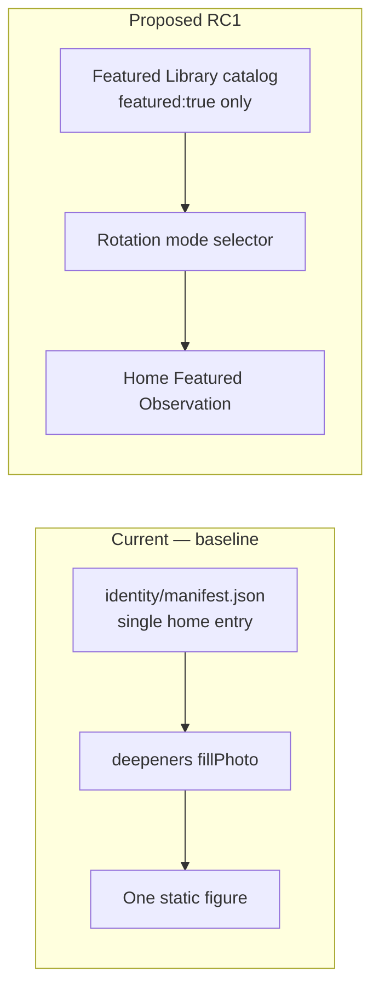
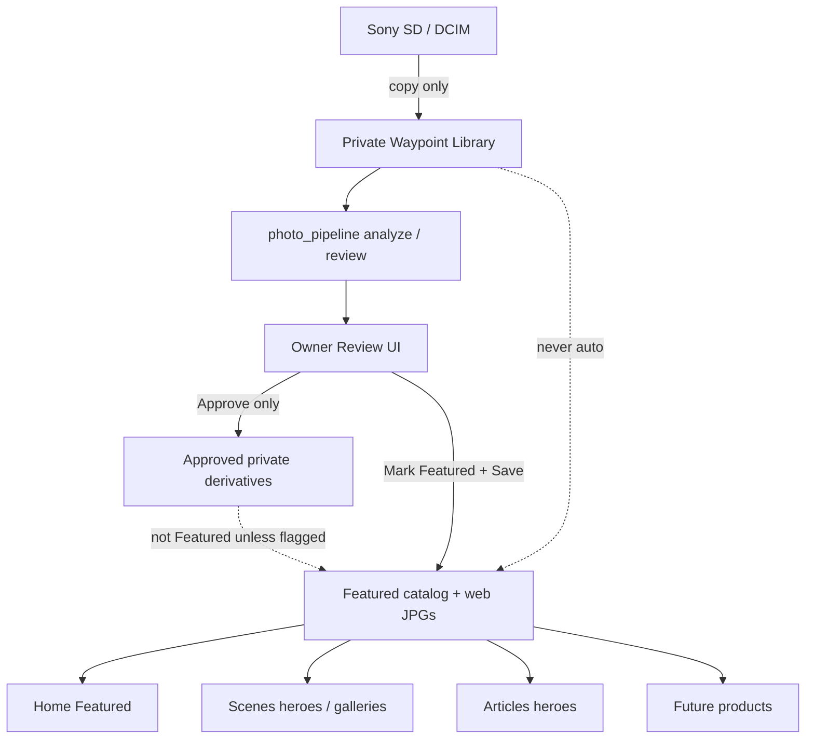
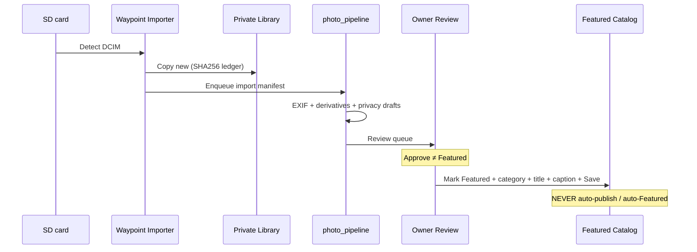

# PHOTOGRAPHY LIBRARY RC1 — Owner Curated Featured Photo System

**Date:** 2026-07-23  
**Status:** **AWAITING OWNER APPROVAL — DO NOT IMPLEMENT UNTIL APPROVED**  
**Scope:** Design / architecture only — permanent Featured Photography Library for Home, Scenes, Articles, and future products.  
**Constraints this turn:** No code implementation · no production wiring rewrite · no commit · no push · no deploy · no stock/AI photography · no invented metadata or Mucarri credits.

**Related (prior forensics — not this RC):**

- `docs/rebuild-2026/platform-photography-and-widget-color-correction-owner-review.md` — field JPG recovery + Mucarri blocker  
- `docs/PHOTO-PIPELINE.md` — SD → analyze → review → approve → `data/media/catalog.json`  
- `docs/IMPORTER-AUDIT.md` — importer inventory  
- `apps/photo-library/docs/PHOTO-LIBRARY.md` — browser IndexedDB private catalog  
- `assets/images/identity/manifest.json` — current public experience slots  

**Baseline evidence (current state only — not “after” implementation):**

| Surface | Desktop | Mobile / phone |
|---------|---------|----------------|
| Home Featured Photography | `docs/rebuild-2026/platform-color-correction/04-desktop-home-featured-photography.png` | `docs/rebuild-2026/platform-visual-regression/08-phone-home-featured-photography.png` |
| Featured attribution caption | `docs/rebuild-2026/platform-color-correction/06-featured-attribution-caption.png` | — |
| Scenes hero | `docs/rebuild-2026/platform-color-correction/05-desktop-scenes-hero.png` | `docs/rebuild-2026/platform-visual-regression/09-phone-scenes-after.png` |
| Home full / Articles | `platform-color-correction/01-desktop-home-full.png` | `platform-visual-regression/05-desktop-articles.png` |

---

## 1. Owner philosophy (non-negotiable)

| Principle | Meaning |
|-----------|---------|
| Authentic owner photography only | No stock, no Unsplash stand-ins, no AI-generated images on public surfaces |
| Curated Featured library | Public surfaces read **Featured** photos only — never a random rotator of all imports |
| Explicit curation | Import ≠ publish. Mark Featured is a deliberate owner act |
| Honest metadata | EXIF when available; empty/null when unknown; never fabricate titles, subjects, locations, or credits |
| Placeholders out | Public surfaces show a Featured photo **or** a professional empty state — never “temporary placeholder” / “replace with owner photography” theater |
| Attribution honesty | Owner credit by default; Mucarri only where recoverable/required (currently **blocked** — see §12) |

---

## 2. Current state (grounded in repo)

### 2.1 What exists today

| Layer | Path / module | Role today | Gap vs RC1 |
|-------|---------------|------------|------------|
| Experience identity slots | `assets/images/identity/manifest.json` + `wds-experience-identity.js` | One static entry per experience (`home`, `dashboard`, `scenes`, `sheds`, `volunteer`) | Not a library; no Featured flag; no rotation modes |
| Home Featured deepener | `wds-dashboard-rebuild-deepeners.js` → `fillPhoto()` | Fetches identity `experiences.home` (fallback `dashboard`); renders figure + caption parts | No “View in Scenes →”; no rotation; empty copy still soft-placeholder-ish if `src` missing |
| Scenes landing hero | `apps/scenes/index.html` + identity `scenes` | `data-identity-img="scenes"` → field JPG `old-growth-cedar.jpg` | Single static hero; submodule pages still hardcode `assets/media/hero.jpg` |
| Featured web assets | `assets/images/featured/` (2 JPGs) + `assets/images/scenes/old-growth-cedar.jpg` | Recovered field captures for Home / Sheds / Scenes | Flat folder — not category library |
| Seasons hero manifest | `assets/images/home/seasons/manifest.json` | Seasonal hero; spring/winter still `placeholder: true` (Unsplash mist bytes on disk) | Parallel system; Unsplash risk if rewired carelessly |
| Browser Photo Library | `apps/photo-library/` (IndexedDB) | Private local catalog for Coach / Hidden Landscapes | Not website SoT; no Featured flag; not deployed as public library |
| Python importer | `waypoint-importer/` | SD → `~/Pictures/Waypoint Library/YYYY/YYYY-MM-DD/` + rclone | No Mark Featured; does not write web catalog |
| Photo pipeline | `photo_pipeline/` | Analyze → review → optional `--publish` → `data/media/catalog.json` | Catalog empty (`assets: []`); no Featured flag; approve ≠ Featured |
| Media API | `design-system/js/media/waypoint-media-api.js` | Consume approved catalog | Unused by Home Featured / Scenes identity today |
| Legacy Scenes gallery | `apps/waypoint-scenes/js/photography-data.js` | Curated static PHOTOS with **mismatched titles** vs pixels | Do not treat as truth; do not auto-promote |

### 2.2 Current public Featured wiring (fact)

```
Home Featured Photography
  └─ identity/manifest.json → experiences.home
       src: assets/images/featured/bog-bridge-evergreens.jpg
       credit: Field capture · iPhone XR

Scenes landing hero
  └─ identity/manifest.json → experiences.scenes
       src: assets/images/scenes/old-growth-cedar.jpg
       credit: Boardwalk Under Canopy · Field capture · Olympus E-M10

Sheds / Volunteer
  └─ identity → fog-forest.jpg (Panasonic DMC-LX7)
```

`data/media/catalog.json` is policy-ready (`auto_publish: false`) but has **zero** approved assets. Identity manifest is the live public path until RC1 replaces it.

### 2.3 Wireframe — current vs proposed (Home Featured)



---

## 3. Architecture (proposed)

### 3.1 Permanent Featured Photography Library

RC1 introduces a **website-facing Featured Photography Library** as the official public photography SoT for:

| Consumer | Use |
|----------|-----|
| **Home** | Featured Photography / Featured Observation deepener |
| **Scenes** | Heroes, critiques examples, galleries, learning frames |
| **Articles** | Article heroes / lead imagery |
| **Future products** | Sheds identity, Volunteer, Dashboard backgrounds, print/licensing, journals — same catalog, Featured-gated |

**Two-tier model (keep both; do not collapse):**

| Tier | Location | Visibility | Purpose |
|------|----------|------------|---------|
| **A. Private import library** | `~/Pictures/Waypoint Library/` + pipeline SQLite + optional browser IndexedDB | Private | All imports; review; Coach; never public by default |
| **B. Featured public library** | Repo: `assets/images/library/` + `assets/images/library/featured-catalog.json` (or evolved `data/media/catalog.json` with `featured: true`) | Public (git / Pages) | Only owner-curated Featured web derivatives + metadata |



### 3.2 Official pipeline for public surfaces

```
Import SD → Importer → Private library
  → Pipeline enqueue / analyze (EXIF, privacy, draft a11y)
  → Owner Review
  → (optional) Approve for private / Coach use
  → Mark Featured → category + title + caption + credit
  → Save → web derivatives copied into Featured tree
  → Catalog updated → Home / Scenes / Articles read Featured only
```

**NEVER auto-publish. NEVER auto-Featured.**  
`approve --publish` (pipeline today) may remain for “approved into website media store,” but **Featured** is a stricter gate: only Featured entries are eligible for Home / Scenes heroes / Articles heroes / rotation modes.

### 3.3 Relationship to existing systems

| Existing | RC1 stance |
|----------|------------|
| `identity/manifest.json` | **Migrate off** as primary SoT. Keep as thin compatibility shim during cutover (pointers into Featured catalog) or retire once consumers use Featured API |
| `photo_pipeline` + `data/media/catalog.json` | Extend with `featured: boolean` + category + curation fields; **or** keep approved catalog separate and add `featured-catalog.json` as the public subset. Prefer one JSON SoT with `featured` flag to avoid dual writes |
| `apps/photo-library/` (browser) | Remains private browser catalog; add UI affordance “Mark Featured…” that stages metadata for the repo/pipeline path — does not silently write Pages |
| `photography-data.js` | Legacy demo data. Do not promote. Optionally retire or rewrite from Featured catalog in a later block |
| Seasons manifest / Unsplash mist | Out of Featured rotation. Seasonal Collection mode uses Featured photos tagged seasonal — not mist stand-ins |

---

## 4. Directory structure (proposed)

```
assets/images/library/
├── README.md                          # Owner rules: Featured vs private; no stock/AI
├── featured-catalog.json              # Public catalog (Featured only, or all approved with featured flag)
├── _inbox/                            # Optional staging for web exports before Featured (gitignored or empty)
│
├── featured/                          # ⭐ Featured-eligible web derivatives only
│   ├── bog-bridge-evergreens.jpg      # (migrate current)
│   └── fog-forest.jpg
│
├── landscapes/
├── wildlife/
├── birds/
├── mushrooms/
├── macro/
├── flowers/
├── forest/
├── rivers/
├── waterfalls/
├── night-sky/
├── weather/
├── fall-color/
├── winter/
│
└── future/                            # Scaffold only — empty until owner content
    ├── infrared/
    └── ultraviolet/
```

**Rules:**

1. Category folders hold **web-optimized derivatives** of Featured (or Featured-candidate) photos — not RAW dumps.  
2. A photo may live in **one primary category folder** and also be referenced under `featured/` via catalog `featured: true` (symlink-or-copy policy: prefer single file + catalog path to avoid byte duplication).  
3. Recommended RC1 file policy: **canonical file under `library/<category>/<slug>.jpg`**; `featured/` is not a second copy — catalog marks Featured; optional convenience copies only if Pages path simplicity requires it.  
4. Extensibility: new categories = new folder + enum entry in catalog schema; no redesign.  
5. Keep `assets/images/identity/placeholders/` for SVG empty-state art if needed — never as fake photography.  
6. Do **not** commit `~/Pictures/Waypoint Library/` originals into the repo.

### 4.1 Catalog schema sketch (`featured-catalog.json`)

```json
{
  "version": 1,
  "updatedAt": null,
  "policy": {
    "autoPublish": false,
    "autoFeatured": false,
    "publicSurfacesRequireFeatured": true,
    "authenticOwnerPhotographyOnly": true,
    "neverFabricateMetadata": true
  },
  "rotationDefaults": {
    "home": "todays-photograph",
    "scenesHero": "featured-random",
    "articles": "explicit-per-article"
  },
  "photos": [
    {
      "id": "wpfeat_…",
      "featured": true,
      "slug": "bog-bridge-evergreens",
      "src": "assets/images/library/forest/bog-bridge-evergreens.jpg",
      "category": "forest",
      "title": "Bog Bridge Through the Evergreens",
      "caption": "Bog bridges lead through moss, roots, and standing timber.",
      "location": null,
      "date": "2020-05-14",
      "camera": "iPhone XR",
      "lens": null,
      "tags": ["forest", "boardwalk", "moss"],
      "alt": "Wooden bog bridges on a mossy trail through dense evergreen forest",
      "copyright": null,
      "credit": "Field capture · iPhone XR",
      "creditSource": "exif-camera",
      "futureNotes": null,
      "exif": { "DateTimeOriginal": "2020:05:14 …", "Make": "Apple", "Model": "iPhone XR" },
      "sourceOriginal": "apps/waypoint-scenes/assets/Images/image0.jpeg",
      "surfaces": { "home": true, "scenes": true, "articles": false },
      "featuredAt": null,
      "favorite": false
    }
  ]
}
```

Nulls are honest. Example values above mirror **current** recovered Home entry for continuity — not new invented content.

---

## 5. Featured flag (⭐)

| State | Meaning | Public Home / Scenes / Articles heroes |
|-------|---------|----------------------------------------|
| `featured: true` | Owner curated for public | Eligible |
| `featured: false` or absent | Private / approved-but-not-Featured | **Ineligible** |
| Import only (no review) | Private | Ineligible |
| Pipeline `approved` without Featured | May exist in `data/media` for non-hero uses later | **Still ineligible** for Featured rotation / Home / Scenes heroes until Mark Featured |

**Star semantics:** UI shows ⭐ only on Featured. Private rating stars in Photo Library (`rating` 1–5) are **not** the Featured flag.

**Default after import:** not Featured. Always.

---

## 6. Metadata design

| Field | Required for Featured? | Source | Fabrication rule |
|-------|------------------------|--------|------------------|
| **Title** | Yes | Owner-authored | Never invent wildlife/place names from pixels alone |
| **Caption** | Recommended | Owner; pipeline may draft | Drafts labeled draft until Save |
| **Location** | Optional | Owner or EXIF GPS (with privacy strip) | Empty if unknown; do not invent parks |
| **Date** | Optional | EXIF `DateTimeOriginal` preferred | mtime only if EXIF missing; mark source |
| **Camera** | Optional | EXIF Make/Model | Omit if absent |
| **Lens** | Optional | EXIF | Omit if absent |
| **Category** | Yes for Featured | Owner pick from enum | Required at Mark Featured |
| **Tags** | Optional | Owner | Normalize; no fake species tags |
| **Alt text** | Yes for Featured | Owner; a11y draft OK | Must describe actual frame |
| **Copyright** | Optional | EXIF / owner | Null if unknown |
| **Credit** | Yes for public | Owner string | Default owner credit pattern; Mucarri only if mapped |
| **Future notes** | Optional | Owner private-ish field | Not shown on public surfaces by default |
| **EXIF pack** | Stored when available | exiftool / pipeline | Read-only; never overwrite originals |

**Honesty note (carry forward):** Legacy `photography-data.js` titled `image0.jpeg` “Elk at Dawn” — pixels are bog bridges. RC1 must not restore mismatched titles.

---

## 7. Photo rotation modes (Featured only)

All modes query **`featured: true` only**. Empty Featured set → professional empty state (not placeholders).

| Mode ID | Label | Selection rule (proposed) |
|---------|-------|---------------------------|
| `todays-photograph` | Today’s Photograph | Deterministic pick from Featured pool using date salt (same photo all day, changes next calendar day) |
| `featured-random` | Random Featured | Uniform random among Featured (session-stable or daily-stable — prefer daily-stable for calm UX) |
| `recent-favorites` | Recent Favorites | Featured ∩ `favorite: true`, ordered by `featuredAt` / `favoriteAt` |
| `landscape-of-the-week` | Landscape of the Week | Featured ∩ category `landscapes` (or `forest`/`rivers`/… per week schedule) |
| `wildlife-highlight` | Wildlife Highlight | Featured ∩ (`wildlife` \| `birds`) |
| `seasonal-collection` | Seasonal Collection | Featured tagged/season-matched to visitor month (owner categories `fall-color`, `winter`, etc.) — **not** Unsplash seasons manifest |

**Home default (proposal):** `todays-photograph` labeled in UI as **Today’s Photograph** / **Featured Observation**.  
**Scenes hero default (proposal):** explicit Featured pick or `featured-random` with daily stability.  
**Articles:** explicit `photoId` per article — no silent rotation unless author opts in.

---

## 8. Surface contracts

### 8.1 Home — Featured Photography / Featured Observation

Replace soft empty copy and single identity slot with Featured library consumer.

| Element | Spec |
|---------|------|
| Image | Featured pick per rotation mode |
| Title | Required |
| Caption | Optional |
| Location | Optional (omit if null) |
| Credit | Required when shown |
| CTA | **View in Scenes →** → `apps/scenes/` (or deep link to gallery entry when available) |
| Empty | Calm empty state: e.g. “No featured photograph yet.” — no placeholder imagery |

**Files that would change (not edited this turn):**  
`design-system/js/dashboard/rebuild/wds-dashboard-rebuild-deepeners.js`, related CSS in `wds-dashboard-rebuild.css`, possibly a small `wds-featured-photography.js` helper.

### 8.2 Scenes

| Use | Spec |
|-----|------|
| Landing hero | Featured photo (identity `scenes` migrates to catalog) |
| Critiques / learning examples | Reference Featured `id`s only for public examples |
| Galleries | Featured-backed collections; private library stays in Photo Library / Coach |
| Submodule heroes | Stop hardcoding Unsplash/mist `hero.jpg`; use Featured or shared empty stage |

### 8.3 Articles

| Use | Spec |
|-----|------|
| Article hero | Optional Featured `photoId` in article front-matter / manifest |
| Index cards | Optional thumb from same Featured id |
| Template today | `articles/templates/article.html` has text-only hero — add Featured image slot when implementing |

---

## 9. Importer integration plan



| Step | Owner action | System |
|------|--------------|--------|
| 1 | Insert SD | Importer detects |
| 2 | Import | Copies to private library; no web write |
| 3 | Review | Pipeline review UI / Photo Library |
| 4 | Mark Featured | Explicit ⭐ + category + title + caption |
| 5 | Save | Web derivative + catalog entry; site surfaces update on next load/build |

**Integration points to wire in implementation (later):**

1. `waypoint-importer` post-import hook → `photo_pipeline` enqueue (partially designed in `docs/PHOTO-PIPELINE.md`)  
2. Review UI action **Mark Featured** distinct from **Approve**  
3. Publish path copies only Featured web assets into `assets/images/library/…` and updates catalog  
4. Browser Photo Library: optional “Queue for Featured…” that exports a manifest for desktop pipeline (local-first; no silent Pages write from browser alone)

---

## 10. Admin experience workflow

**Happy path:**

1. Select photo in Review / Photo Library / Admin Featured panel  
2. **Mark Featured** (⭐)  
3. Choose **Category** (required)  
4. Enter **Title** (required)  
5. Enter **Caption** (recommended)  
6. Confirm **Credit** / alt (prefill from EXIF camera when present; owner edits)  
7. **Save**  
8. Site consumers read updated catalog → Home / Scenes / Articles update  

**Guards:**

- Cannot Mark Featured without title + category + alt  
- Privacy verdict `Do not publish` blocks Featured until resolved  
- GPS stripped or location withheld per privacy flags before public Save  
- Bulk Mark Featured disallowed in RC1 (one-at-a-time curation)

**Proposed admin surface (implementation later):** extend `apps/photo-pipeline/` review UI, or a thin `apps/featured-admin/` page reading local review export — not a cloud CMS.

---

## 11. Placeholder removal plan

| Surface | Current risk | RC1 target |
|---------|--------------|------------|
| Home Featured | Field JPG OK now; empty path still soft copy | Featured photo **or** professional empty state |
| Scenes landing | Field JPG OK | Featured only |
| Scenes submodules | Hardcoded `hero.jpg` (may be mist stand-in copies) | Featured or empty stage |
| Seasons manifest | spring/winter `placeholder: true` + Unsplash bytes | Out of Featured scope; do not use for Featured rotation |
| Identity SVG placeholders | Still on disk under `identity/placeholders/` | Empty-state graphics only — never as photo stand-ins |
| Body copy | “replace with owner photography” removed on Home/Scenes in prior correction | Keep banned; lint/smoke if useful later |

**Professional empty state (copy sketch — not shipped this turn):**  
“No featured photograph yet.” / “Featured frames will appear here when curated.” — calm, no urgency, no fake image.

---

## 12. Attribution

| Rule | Detail |
|------|--------|
| Owner credit | Default public credit pattern owned by Bryan / Waypoint Studio field capture language |
| Camera in credit | Allowed when EXIF present (current practice: `Field capture · iPhone XR`) |
| **Anthony Mucarri** | **Blocked** — prior forensic found **zero** matches in working tree, `git grep` history, or EXIF Artist/Copyright/By-line. Do **not** invent. Owner must supply photo↔credit mapping if Mucarri should appear |
| Evidence | `docs/rebuild-2026/platform-photography-and-widget-color-correction-owner-review.md` § Anthony Mucarri attribution; screenshot `06-featured-attribution-caption.png` |

---

## 13. Future capabilities (no redesign required)

Catalog + Featured flag + categories unlock without architecture rewrite:

| Capability | Hook |
|------------|------|
| Collections | `collectionIds` on photos / separate collections array |
| Photo of the Day | Alias of `todays-photograph` mode + archive history |
| Seasonal galleries | Category folders + seasonal tags |
| Search / filter | Catalog fields: title, tags, category, camera, date |
| Favorites | `favorite` already sketched; Recent Favorites mode |
| Wallpapers | Large derivative size in versions |
| Print store / licensing | `copyright`, `credit`, licensing enum later |
| Journals / field notes | `futureNotes` + link to articles |
| Citizen science | Species tags only when evidenced; privacy-first location |
| Infrared / UV | `library/future/infrared|ultraviolet` + pipeline hooks (`photo_pipeline hooks`) |

---

## 14. Files that WOULD change (proposed — not edited this turn)

### New (proposed)

| Path | Role |
|------|------|
| `assets/images/library/**` | Category tree + Featured web derivatives |
| `assets/images/library/featured-catalog.json` | Public Featured SoT (or extend `data/media/catalog.json`) |
| `design-system/js/media/wds-featured-library.js` | Load catalog, rotation modes, empty state |
| `apps/photo-pipeline/` or `apps/featured-admin/` | Mark Featured UI |
| `docs/FEATURED-PHOTOGRAPHY-LIBRARY.md` | Operator guide after approval |
| Tests under `automation/` / `tests/` | Catalog schema, Featured gate, no auto-publish |

### Modify (proposed)

| Path | Role |
|------|------|
| `design-system/js/dashboard/rebuild/wds-dashboard-rebuild-deepeners.js` | Consume Featured catalog; add View in Scenes → |
| `design-system/js/platform/wds-experience-identity.js` | Delegate to Featured library or become shim |
| `assets/images/identity/manifest.json` | Cutover shim or deprecate |
| `apps/scenes/index.html` (+ submodule heroes) | Featured-backed heroes |
| `articles/templates/article.html` + article CSS | Optional Featured hero slot |
| `photo_pipeline/approve.py` / `catalog.py` | `featured` flag + Featured export path |
| `waypoint-importer/` hook | Already planned enqueue; ensure no Featured side effects |
| `design-system/js/media/waypoint-media-api.js` | Filter `featured: true` helpers |
| `assets/images/featured/README.md` | Point to library tree after migrate |

### Explicitly out of scope for RC1 implementation

- Rewriting Photo Coach critique engine  
- Migrating all of `photography-data.js`  
- Deleting Unsplash mist files (quarantine / stop wiring sufficient)  
- Commit / push / deploy  

---

## 15. Screenshots & diagrams (baseline / current state)

**Do not treat the following as post-RC1 “after” shots.** They document today’s recovered field photography surfaces.

### Baseline captures (already on disk)

1. **Home Featured — desktop** — `docs/rebuild-2026/platform-color-correction/04-desktop-home-featured-photography.png`  
2. **Home Featured — phone** — `docs/rebuild-2026/platform-visual-regression/08-phone-home-featured-photography.png`  
3. **Attribution caption** — `docs/rebuild-2026/platform-color-correction/06-featured-attribution-caption.png`  
4. **Scenes hero — desktop** — `docs/rebuild-2026/platform-color-correction/05-desktop-scenes-hero.png`  
5. **Scenes — phone** — `docs/rebuild-2026/platform-visual-regression/09-phone-scenes-after.png`  
6. **Articles index** — `docs/rebuild-2026/platform-visual-regression/05-desktop-articles.png` (text heroes today)

### Proposed Home Featured layout (wireframe — not a screenshot)

```text
┌─────────────────────────────────────────────────────────┐
│  Featured Photography                                   │
│  Frames from the field — captioned and credited.        │
│                                                         │
│  ┌─────────────────────────────────────────────────┐   │
│  │                                                 │   │
│  │           [ Featured photograph ]               │   │
│  │                                                 │   │
│  └─────────────────────────────────────────────────┘   │
│  Title                                                 │
│  Optional caption · Optional location                  │
│  Credit                                                │
│  View in Scenes →                                      │
└─────────────────────────────────────────────────────────┘
```

### Admin Mark Featured (wireframe)

```text
┌─ Review ───────────────────────────────────────────────┐
│  [thumb]  filename.JPG                                 │
│  EXIF: date · camera · lens (or —)                     │
│                                                        │
│  [ ] Approve   [⭐] Mark Featured                      │
│  Category: [ Forest ▼ ]                                │
│  Title:    [ ________________ ]                        │
│  Caption:  [ ________________ ]                        │
│  Credit:   [ Field capture · … ]                       │
│  Alt:      [ ________________ ]                        │
│                               [ Cancel ]  [ Save ]     │
└────────────────────────────────────────────────────────┘
```

---

## 16. Future expansion recommendations

1. **Cut over identity → Featured catalog** in one small PR after Featured has ≥3–5 owner-curated frames.  
2. **Quarantine Unsplash mist** (`hero.jpg` / seasons / mist-valley) from any public wiring; document MD5 `717cfdc…`.  
3. **Unify catalogs** — prefer extending `data/media/catalog.json` with `featured` over maintaining two JSON SoTs long-term.  
4. **Daily-stable rotation** over per-load random for calm product feel.  
5. **Articles opt-in heroes** before any global article rotation.  
6. **Owner Mucarri mapping file** (private or repo) if/when credits must appear — never agent-invented.  
7. **Infrared/UV** stay under `library/future/` until capture workflow exists (`photo_pipeline hooks`).  
8. **Deprecate mismatched legacy gallery titles** when Scenes gallery is rebuilt from Featured.

---

## 17. Known limitations

| Limitation | Impact |
|------------|--------|
| Featured catalog does not exist yet | Home/Scenes still on identity manifest |
| `data/media/catalog.json` empty | Pipeline publish path unused in production |
| Two private libraries (disk + IndexedDB) | Browser Mark Featured needs a clear handoff story |
| Two importers (Python + Node CLI) | Prefer Python as disk SoT (`IMPORTER-AUDIT.md`) |
| Mucarri attribution unrecoverable from repo | Credits stay field/camera language until owner maps |
| Legacy `photography-data.js` lies about subjects | Must not seed Featured titles |
| Seasons Unsplash placeholders remain on disk | Risk if someone rewires seasons into Featured |
| Submodule Scenes pages hardcode heroes | Separate cleanup when implementing |
| No admin Featured UI yet | Design only this turn |
| Git Pages size | Web derivatives only; originals stay off-repo |
| This document is not approval to build | See status banner |

---

## 18. Implementation readiness checklist (post-approval)

When owner approves, implementation should:

1. Create `assets/images/library/` tree + catalog schema + migrate current three field JPGs as initial Featured seeds (honest titles/captions already in identity manifest)  
2. Add Featured flag to pipeline decide / review UI  
3. Wire Home deepener + Scenes hero to Featured API  
4. Add “View in Scenes →”  
5. Professional empty states  
6. Tests: Featured gate, no auto-Featured, null metadata honesty  
7. Capture new after screenshots only after code exists  
8. Append playbook lessons from the build block  

---

## 19. Decision requested from owner

Please approve or amend:

1. **Two-tier model** — private import library vs Featured public catalog  
2. **Featured-only** public heroes / rotation modes  
3. **Directory / category list** (including future infrared/UV scaffolds)  
4. **Home default mode** = Today’s Photograph  
5. **Catalog SoT preference** — extend `data/media/catalog.json` **or** new `featured-catalog.json`  
6. **Credit policy** — keep field/camera credits until Mucarri mapping supplied  

---

**AWAITING OWNER APPROVAL — DO NOT IMPLEMENT UNTIL APPROVED**
