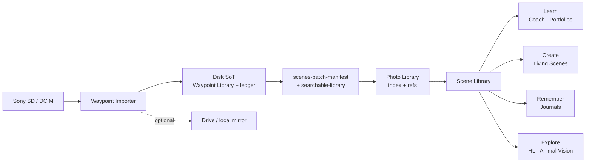

# Import → Scenes — Seamless Photo Journey (Owner Review)

**Audience:** Product owner · engineering leads  
**Date:** 2026-08-04  
**Branch:** `docs/scenes-import-workflow`  
**Base:** `origin/main` @ `59c09deb`  
**Scope:** Architecture and shared metadata design only — **no major features**, **no merge**, **no deploy**.  
**Repos:** Prefer studio docs; Importer reviewed read-only as evidence.

**Companions (do not overwrite):**  
[`create-explore-owner-review.md`](./create-explore-owner-review.md) (imaging / SIE) · Learn pillar / Sprint 3 owner reviews on feature branches · `docs/IMPORTER-AUDIT.md` (historical; path conventions outdated vs Electron).

---

## Verdict

One journey, three catalogs today, one intended handoff:

> **Sony SD → Waypoint Importer (disk SoT) → Photo Library (catalog + refs) → Scene Library (session workspace) → Learn → Create → Remember → Explore**

**Do not invent cloud products.** Google Drive / local mirror remain an **optional side path** after verified local import. Originals stay on disk under the library home; browser modules reference photos — they do not become a second library tree.

**Key recommendation — one shared photo identity:**

| Layer | Role | Authority |
|-------|------|-----------|
| **Disk originals** | Sacred bytes + EXIF sidecars + thumbs | Waypoint Importer / `~/Pictures/WaypointStudio` |
| **Photo ID (UUID)** | Cross-product stable id once assigned | Shared catalog contract (assign at Photo Library ingest) |
| **Content SHA-256** | Durable content identity / dedupe | Importer ledger (canonical) |
| **Scene** | One outdoor session / shoot workspace | Scene Library (`feature/scenes-sprint3-scene-library`+) |

---

## Journey map



Canonical Learn rail (feature evidence): Importer → Photo Library → Scene Library → Photo Coach → Portfolio Assistant → Coach → Builder → Health  
(`feature/scenes-learn-pillar-workflow`). Create / Remember / Explore stay **parallel pillars** that consume the same Scene + photo refs — not a second import path.

---

## 1. What we reviewed

### 1.1 Waypoint Importer (sibling repo — read-only)

| Area | Path / artifact | Status |
|------|-----------------|--------|
| Library ledger | `~/Pictures/WaypointStudio/.waypoint-library-index.json` | Live Electron SoT |
| Organize layout | `Waypoint Library/YYYY/YYYY-MM-DD/{RAW\|JPEG\|VIDEO}/` | Live |
| EXIF sidecars | `{dest}.exif.json` beside media | Live (`exifr` pick list) |
| Thumbnails | `.waypoint-thumbs/` (sharp / ffmpeg) | Live; ARW best-effort |
| Catalog IPC | `library:query` / annotations / collections | WIP library manager |
| Scenes manifest | `.waypoint-pipeline/manifests/{importId}.json` | **Written**; not consumed by Studio |
| Coach handoff | `.waypoint-pipeline/coach-handoffs/{importId}.json` | Staged; `receiveSession` not-implemented |
| Deep links | `openScenes(?importId=)` · `photoLibraryUrl` | URL only — no data push |
| Drive sync | rclone queue + optional local mirror | Optional side path |

**Identity today (Importer):** weak scan fingerprint (`name|size|mtime` SHA-1) + content **SHA-256** + catalog `key` (prefer `destPath`). No stable UUID on ledger entries yet. Unused helper: `contentFingerprint(sha256)`.

**Known gap:** post-import integration sometimes runs from progress stats without full per-file lists → manifests / searchable upserts can be thin unless history already has files.

### 1.2 Photo Library (Studio — live on main)

| | |
|--|--|
| **App** | `apps/photo-library/` |
| **Doc** | `apps/photo-library/docs/PHOTO-LIBRARY.md` |
| **Index** | `localStorage` `waypoint-photo-library-index-v1` |
| **Media** | IndexedDB `waypoint-photo-library-media-v1` |
| **Model** | `LibraryImage` UUID + weak `name::size::lastModified` fingerprint |
| **EXIF** | Not parsed on browser import; null unless migrated / provided |
| **Importer source** | `source: "importer"` field exists; **no live desktop ingest** |

Purpose (unchanged): one catalog so Coach / Hidden Landscapes / Scene Builder reference a photo once.

### 1.3 Scene Library (feature branches — not on main)

| Evidence branch | Contribution |
|-----------------|--------------|
| `feature/scenes-sprint3-scene-library` | Scene + Photo model, store, ingest API, Library + Shoot Review UI |
| `feature/scenes-learn-pillar-workflow` | Learn rail; Create Scene from Photo Library |
| `feature/scenes-sprint4-scene-native-photo-coach` | Scene-native Coach direction |
| `feature/scenes-remember-pillar-foundation` | Remember docs / `photoRefs` |
| `docs/scenes-create-explore-architecture` | Create × Explore / SIE imaging plan |

**Locked ingest contract:** `WaypointSceneIngest.ingestFromImporterPayload(payload)` — shape frozen; Electron does not call it yet. Preferred path once Photo Library is filled: `ingestFromLibraryFolder` so Scene photos use `originalRef: "library:{id}"` and reuse library UUIDs.

Persistence: Scene metadata in `waypoint-scene-library-index-v1` (cap 500). Full-res pixels are **refs only**.

### 1.4 Path convention note (honest)

| Era | Library root |
|-----|----------------|
| Electron Importer (current) | `~/Pictures/WaypointStudio/Waypoint Library/…` |
| Older Python / IMPORTER-AUDIT | `~/Pictures/Waypoint Library/…` |

Design target: **one home** — `~/Pictures/WaypointStudio` — with relative paths under `Waypoint Library/`. Document dual roots as migration debt; do not invent a third.

---

## 2. Shared metadata model (design)

Unify names across Importer ledger, browser Photo Library, and Scene photos **without** requiring a cloud service.

### 2.1 Identifiers

| Field | Type | Rule |
|-------|------|------|
| `photoId` | UUID | Assigned when a photo enters the **shared Photo Library catalog**. Scene photos that come from the library **reuse** this id. |
| `contentSha256` | lowercase hex | Canonical content identity from Importer verify. Prefer for cross-device / re-import dedupe. |
| `weakFingerprint` | string | Scan-time / browser-only (`name\|size\|mtime` or `name::size::lastModified`). **Never** the only cross-product key. |
| `libraryRelativePath` | POSIX relative | e.g. `Waypoint Library/2026/2026-07-28/JPEG/DSC01234.JPG` — stable when the library home moves. |
| `destPath` | absolute | Local absolute when known (Electron); optional in browser records. |
| `importId` | string | Batch / session id from Importer; links manifests + history. |
| `sceneId` | UUID | Scene Library session id. |
| `projectRef` | string | Soft link for portfolios / journals / living scenes / explore exports — store in `moduleRefs` / document `photoRefs`, not a second photo row. |

**Assignment order:**

1. Importer copies + hashes → ledger entry has `sha256`, paths, sidecar, thumb (no UUID required on disk).  
2. Photo Library ingest (from manifest or file picker) → mint `photoId` UUID; store `contentSha256` + `libraryRelativePath` + EXIF from sidecar when available.  
3. Scene ingest from library → photo.`id` = `photoId`; `originalRef` = `library:{photoId}`.  
4. Pillars write **back** only via `moduleRefs` / document refs — never fork a new identity for the same bytes.

### 2.2 Photo record (canonical field set)

Align `LibraryImage`, Electron `LibraryCatalogItem`, and Scene `Photo` on this core. Missing values stay `null` — never invent EXIF.

```text
WaypointSharedPhoto {
  schemaVersion: "1.0.0"
  photoId: UUID

  identity:
    originalFilename, mimeType?, byteSize?
    contentSha256?, weakFingerprint?
    libraryRelativePath?, destPath?
    importId?, source: importer | upload | migration-* | …

  dates:
    captureDate?, importDate, updatedAt

  capture:
    camera: { make, model, lens, iso, fNumber, shutter, exposureTimeSec?, focalLengthMm }
    gps: { lat, lon, accuracyM? } | null
    orientation?, width?, height?, aspectRatio?
    folderKind?: RAW | JPEG | VIDEO
    mediaKind?: still | video | …

  previews:
    thumbnailRef:   # file:// or path under .waypoint-thumbs | data URL | IndexedDB key
    sidecarRef?:    # *.exif.json path when on disk

  curation:         # private; not public scores
    rating?, favorite?, selectionLabel?, tags[], collectionIds[], notes?

  moduleRefs:       # soft project references
    photoLibraryId?, sceneIds[], photoCoach?, hiddenLandscapes?,
    livingScenes?, sceneBuilder?, rememberDocIds[], portfolioIds[]
}
```

### 2.3 Folder / preview / EXIF handling

| Concern | Standard |
|---------|----------|
| **Folders** | Disk layout owned by Importer: `YYYY/YYYY-MM-DD/{RAW\|JPEG\|VIDEO}/`. Browser “collections” are curation, not filesystem folders. Scene `storageLocations[]` lists human labels (`Local library`, optional `Google Drive`). |
| **Previews** | Prefer Importer `.waypoint-thumbs/` paths when Studio can read the filesystem; otherwise generate browser thumbs (~320–512px) without replacing disk thumbs. Scene UI uses `thumbnailUrl` refs only. |
| **EXIF** | Importer writes sidecars (authoritative for organize date + camera pack). Photo Library / Scene ingest **copy** fields from sidecar or manifest — do not re-guess. Browser JPEG EXIF readers (Coach) remain for uploads that never touched Importer. |
| **Project references** | Always soft: `moduleRefs`, Scene `photos[].moduleRefs`, Remember `photoRefs[]`. No duplicated originals per pillar. |

### 2.4 Scene batch (session) envelope

Map Importer `scenes-batch-manifest` → Scene ingest / Photo Library batch:

| Manifest field (Importer today) | Shared / Scene target |
|---------------------------------|------------------------|
| `protocolVersion` / `kind` | Keep `1.0.0` / `scenes-batch-manifest` |
| `importId` | `importId` on photos + Scene notes |
| `libraryRoot` | Resolve `libraryRelativePath` |
| `deviceProfile` | Scene `camera` / storage metadata |
| `files[].localPath` | `destPath` + derive relative |
| `files[].sha256` | `contentSha256` |
| `files[].captureDate` | `captureDate` / photo `captureTime` |
| `files[].fileName` | `originalFilename` |

**Preferred Studio consume order:**

1. Read manifest + (optional) ledger / sidecars.  
2. Upsert Photo Library rows (mint `photoId`, attach SHA + paths + EXIF).  
3. `ingestFromLibraryFolder` → one Scene per import batch (or per capture-day if batch spans days — product choice; default **one Scene per importId** unless owner prefers day split).  
4. Deep link `?sceneId=` / Learn rail — not a second copy of files.

### 2.5 Optional Drive side path (not cloud product)

- After local verify, Importer may enqueue rclone / local mirror using the **same relative paths**.  
- Shared model may record `storageLocations: ["Local library", "Google Drive"]` when mirror succeeded.  
- Scenes / Photo Library **must not** require Drive online to open a Scene.  
- No new sync service, CDN, or account cloud is in scope for this journey.

---

## 3. Architecture / integration points

```text
~/Pictures/WaypointStudio/
  Waypoint Library/…          originals (SoT)
  .waypoint-thumbs/           disk previews
  .waypoint-library-index.json
  .waypoint-pipeline/
    manifests/{importId}.json          ← Importer writes
    searchable-library.json
    coach-handoffs/{importId}.json
    library-annotations.json
    import-history/…

Browser (Studio):
  waypoint-photo-library-index-v1      ← mint photoId; refs + metadata
  waypoint-photo-library-media-v1      ← optional blob cache (uploads / selected proxies)
  waypoint-scene-library-index-v1      ← Scenes; library:{photoId} refs
```

| Integration point | Producer | Consumer | Status |
|-------------------|----------|----------|--------|
| Disk library + ledger | Importer | Deduplication, library manager | Live |
| `scenes-batch-manifest` | Importer `integrationPipeline` | Photo Library / Scene ingest | Written; **unconsumed** |
| `searchable-library.json` | Importer | Future Studio search | Written; parallel to ledger |
| Catalog IPC | Importer Electron | Importer UI `LibraryPanel` | Live in-app |
| `ingestFromImporterPayload` | Intended: bridge | Scene Library | Contract locked; unwired |
| `ingestFromLibraryFolder` | Photo Library selection | Scene Library | Implemented on sprint3/learn branches |
| `?libraryId=` client | Photo Library | Coach / Hidden Landscapes | Live on main |
| `openScenes(?importId=)` | Importer | Studio URL | Deep link only |
| Learn rail | `learn-pillar-workflow.js` | Module chrome | Feature branch |
| Drive / mirror | Importer sync queue | Optional backup | Optional |

---

## 4. Pillar handoff (after Scene exists)

| Pillar | Entry | Photo wiring |
|--------|-------|--------------|
| **Learn** | Scene → Photo Coach → Portfolios | `library:{id}` / `sceneId`; no re-upload |
| **Create** | Living Scenes / SIE (see create-explore review) | Same ImageSource + `photoId` provenance |
| **Remember** | Journals / calendars / books | `photoRefs[]` → `photoId` / `sceneId` |
| **Explore** | Hidden Landscapes / Animal Vision | `?libraryId=` today; Scene cover later |

Imaging pixel pipelines are out of scope here — see Create × Explore / SIE docs. This document only requires that those surfaces accept **shared photo ids**, not a fresh SD import.

---

## 5. Remaining work (ordered)

1. **Fix Importer manifest completeness** — ensure completed imports always write real `files[]` (`destPath`, `sha256`, capture dates) into scenes manifests (Importer repo; small repair).  
2. **Photo Library desktop ingest** — Studio reader for `scenes-batch-manifest` + sidecars → upsert `LibraryImage` with `source: "importer"`, `contentSha256`, `libraryRelativePath`, EXIF copy; mint `photoId`. Prefer file/URL bridge or local folder picker over inventing a network API.  
3. **Scene from library (default path)** — after ingest, call `ingestFromLibraryFolder` (or auto-create Scene per `importId`); wire `openScenes` to `?sceneId=` once created (or resolve `importId` → scene).  
4. **Stable id on annotations** — key curation by `photoId` (with SHA/path fallback) so renames do not orphan ratings.  
5. **Merge Scene Library to a shippable Scenes line** — sprint3 + learn rail; pick canonical shell (`apps/waypoint-scenes` vs `apps/scenes`) with redirects.  
6. **Scene-native Coach** — `?sceneId=` loads frames via library refs (sprint4 direction).  
7. **Path migration note** — document / optionally detect legacy `~/Pictures/Waypoint Library` vs `WaypointStudio` home.  
8. **Explicitly defer** — cloud sync products, AI auto-tagging, auto-publish, second WebGL stacks.

---

## 6. Risks

| Risk | Impact | Mitigation |
|------|--------|------------|
| Dual catalogs (disk ledger vs browser IndexedDB) | Users see “empty library” in Studio after a successful card import | Manifest → Photo Library ingest as first wiring sprint |
| Weak fingerprints used as SoT | False dedupe / missed dedupe across apps | SHA-256 for content; UUID for product refs |
| Empty/thin manifests | Scenes open with zero photos | Fix file-list handoff in Importer integration |
| Parallel Scene vs Library folder imports | Duplicate Scene photos without `library:` refs | Learn rail: “Create Scene from library”; discourage raw folder as default |
| Unmerged Scene Library | Journey stops at Photo Library on main | Ship Scene Library on Scenes feature line before marketing the full journey |
| Path split (Python vs Electron) | Broken absolute paths in old docs/tools | Single `WaypointStudio` home; relative paths in shared model |
| Drive treated as required | Offline / privacy failure | Keep Drive optional; local SoT always wins |
| Overwriting parallel agent docs | Lost work | This file only: `docs/scenes/import-workflow-owner-review.md` |

---

## 7. Out of scope (intentional)

- New cloud backup / sync product surfaces  
- Auto-publish to the public website  
- Invented AI scores or fabricated EXIF  
- Rewriting Photo Coach or Hidden Landscapes engines  
- Merging or deploying any branch as part of this review  

---

## 8. Recommended owner decisions

1. **Confirm** disk home `~/Pictures/WaypointStudio` as the single local SoT.  
2. **Confirm** Photo Library as the Studio-facing catalog that mints `photoId`; Scene Library consumes library refs (not a competing catalog of originals).  
3. **Confirm** default Scene granularity: **one Scene per `importId`** (owner may choose capture-day split later).  
4. **Confirm** Drive remains optional side path only.  
5. **Approve** next implementation slice: manifest completeness (Importer) + Photo Library ingest from manifest (Studio) — still no merge/deploy until a dedicated implementation sprint.

---

## 9. Evidence index

| Artifact | Location |
|----------|----------|
| Electron library types | `waypoint-importer/shared/libraryTypes.ts` |
| Integration / scenes manifest | `waypoint-importer/electron/services/integrationPipeline.ts` |
| Photo Library architecture | `apps/photo-library/docs/PHOTO-LIBRARY.md` |
| Photo Library models | `apps/photo-library/js/pl-models.js` |
| Scene models / ingest | `feature/scenes-sprint3-scene-library` → `apps/waypoint-scenes/js/scene-library/*` |
| Sprint 3 owner review | `docs/rebuild-2026/scenes-sprint3-owner-review.md` (on sprint3/learn branches) |
| Learn pillar owner review | `docs/scenes/learn-pillar-owner-review.md` (learn-pillar branch) |
| Historical importer audit | `docs/IMPORTER-AUDIT.md` (main; path conventions partially stale) |

---

**Status:** Stop for owner review — docs only on `docs/scenes-import-workflow`. **No merge. No deploy.**
