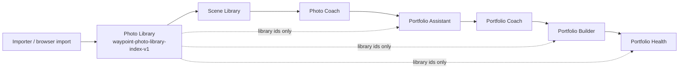

# Learn Pillar Owner Review

**Branch:** `feature/scenes-learn-pillar-workflow`  
**Tip:** `381d500` (381d500027a266851da08a33ff23486418831b35)  
**Date:** 2026-08-03  
**Scope:** Connect existing photography modules into one Learn workflow. No new AI features.

---

## Why this base

**Base:** `feature/scenes-photo-coach-2-architecture` (`9ae7891`)

| Reason | Detail |
| --- | --- |
| Already includes Sprint 1 pillars | `apps/waypoint-scenes/{create,explore,remember}/` + foundation home |
| Already includes Sprint 3 Scene Library | `apps/waypoint-scenes/library/` + `js/scene-library/*` |
| Already includes Photo Coach 2 | `apps/waypoint-scenes/js/photo-coach-2/*` + `apps/photo-coach/review-v2/` |
| Shared library client / importer contracts | `photo-library-client.js`, `photo-coach-importer-bridge.js` |
| Avoids Dashboard WIP | Did **not** base on `feature/platform-consolidation` or RC4 dashboard branches |

**Brought in from** `origin/feature/scenes-portfolio-health` (`6a38dbb`): full portfolio suite through Health (Assistant, Coach modules, Builder, Health) plus prior owner-review docs.

Website Output (`feature/scenes-portfolio-website-output`) was intentionally left out of this wiring sprint — it sits after Portfolio Health.

---

## Workflow diagram

Canonical step list lives in `apps/scenes/js/learn-pillar-workflow.js` (`WaypointLearnPillarWorkflow`).

---

## Inventory — where each step already lived

| Step | Primary location | Best branch before this work |
| --- | --- | --- |
| Importer | Desktop: Waypoint Importer (sibling product). Web: Photo Library import + `photo-coach-importer-bridge.js` / `scene-ingest.ingestFromImporterPayload` contracts | main + photo-coach-2 |
| Photo Library | `apps/photo-library/` (`pl-models` / `pl-store` / `pl-engine`) · redirect `apps/scenes/photo-library/` | main |
| Scene Library | `apps/waypoint-scenes/library/` + `js/scene-library/*` | `feature/scenes-sprint3-scene-library` |
| Photo Coach | `apps/photo-coach/` + Scene bridge + Coach 2 under `js/photo-coach-2/` | `feature/scenes-photo-coach-2-architecture` |
| Portfolio Assistant | `apps/scenes/portfolio/assistant.html` + `js/assistant-*` | `feature/scenes-portfolio-assistant` |
| Portfolio Coach | Same assistant surface + `js/coach-*` (not a separate HTML app) | `feature/scenes-portfolio-coach` |
| Portfolio Builder | `apps/scenes/portfolio/builder.html` + `js/builder-*` | `feature/scenes-auto-portfolio-builder` |
| Portfolio Health | `apps/scenes/portfolio/health.html` + `js/health-*` | `feature/scenes-portfolio-health` |

Related but **out of Learn wiring scope** this sprint:

- Remember pillar: `feature/scenes-remember-pillar-foundation` (Create/Remember/Explore stay separate pillars)
- Turnaround Sprint 05: surface cleanup only
- Dashboard / platform consolidation branches: left alone

---

## What was wired in this branch

| Integration | Status |
| --- | --- |
| Shared Learn workflow module + CSS rail | Done — `apps/scenes/js/learn-pillar-workflow.js`, `css/learn-pillar-workflow.css` |
| Rail on Photo Library, Scene Library, Scenes homes, Portfolio pages | Done |
| Nav order: Library → Scene Library → Coach → Portfolios | Done — `wds-app-nav-config.js`, `nav-registry.json` |
| Platform workflow handoffs for Learn steps | Done — `wds-platform-workflows.js` |
| Portfolio stub → real suite | Done — `apps/waypoint-scenes/portfolio/` redirects to `apps/scenes/portfolio/` |
| Scene detail links → Portfolio Assistant / Portfolios | Done — `scene-detail-ui.js` |
| Create Scene from Photo Library index | Done — Scene Library button uses existing `ingestFromLibraryFolder` |
| Portfolio Coach deep link `#coach` | Done — assistant boot scrolls / status when hash is `coach` |
| Library-empty messaging on gated steps | Done — rail + existing portfolio empty copy |
| New AI / analysis features | **Not added** (by design) |

---

## Remaining gaps

1. **Desktop Importer → library index** — browser contracts exist; live handoff from the Electron Importer into `waypoint-photo-library-index-v1` is still a product bridge, not finished in this repo alone.
2. **Scene ↔ Photo Coach without re-upload** — Scene-aware Coach still partially banners “lands next”; Coach 2 architecture is present but not the sole production entry.
3. **Duplicate surfaces** — `apps/scenes/` landing vs `apps/waypoint-scenes/` foundation both advertise Learn; rail unifies them, but a single canonical Scenes home remains desirable.
4. **Portfolio Coach is not its own route** — lives inside Assistant (`assistant.html#coach`); fine for UX, but nav cannot highlight a distinct page.
5. **Remember / Create / Explore** — not part of this Learn chain; still parallel pillars.
6. **Website Output** — exists on `feature/scenes-portfolio-website-output`; not wired into the Learn rail yet.
7. **Absolute `/apps/...` links** in Scene detail — consistent with prior Coach links; project-pages base-path hardening still a platform concern.

---

## Technical debt

- Two Scenes shells (`apps/scenes` craft home vs `apps/waypoint-scenes` four-pillar home) share purpose and now share the Learn rail, but CSS/visual language still differs.
- Portfolio suite scripts are many small IIFEs; no bundler — acceptable for static Pages, harder to tree-shake duplicates.
- Scene Library folder import and Photo Library import can create parallel catalogs until users consistently use “Create Scene from library”.
- `current-state-reconciliation.md` (from portfolio-health) may overlap a parallel agent’s `scenes-reconciliation-report.md` — do not merge those blindly; this file is **`learn-pillar-owner-review.md`** only.

---

## Recommended next sprint

1. **Importer handoff** — stage validated payloads into Photo Library index (reuse `photo-coach-importer-bridge` + `scene-ingest.ingestFromImporterPayload`).
2. **Canonical Scenes home** — pick one landing (`waypoint-scenes` vs `scenes`) and redirect the other; keep Learn rail.
3. **Scene-native Photo Coach entry** — make `?sceneId=` load frames via library refs without upload prompt.
4. **Optional:** add Website Output as step 9 on the Learn rail after Health.
5. **Smoke automation** — extend `automation/test-scenes-*.mjs` with a Learn-rail presence check across the eight surfaces.

---

## Verification notes

- No merge to `main`. No deploy.
- Worktree: `/tmp/waypoint-studio-learn-pillar` (preserves `feature/platform-consolidation` WIP + stashes in primary checkout).
- Parallel docs agent: avoided overwriting `docs/scenes/scenes-reconciliation-report.md` / `scenes-owner-review.md`.
